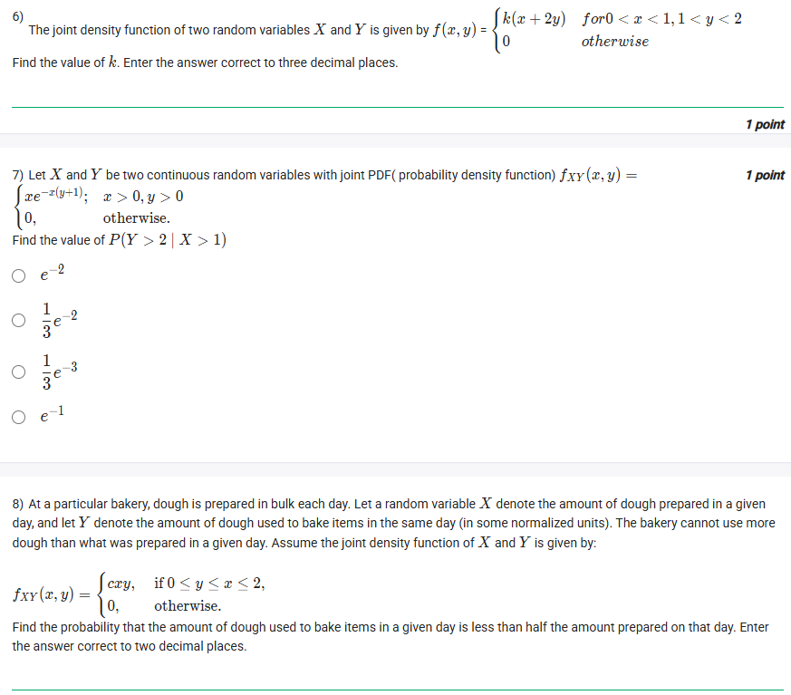
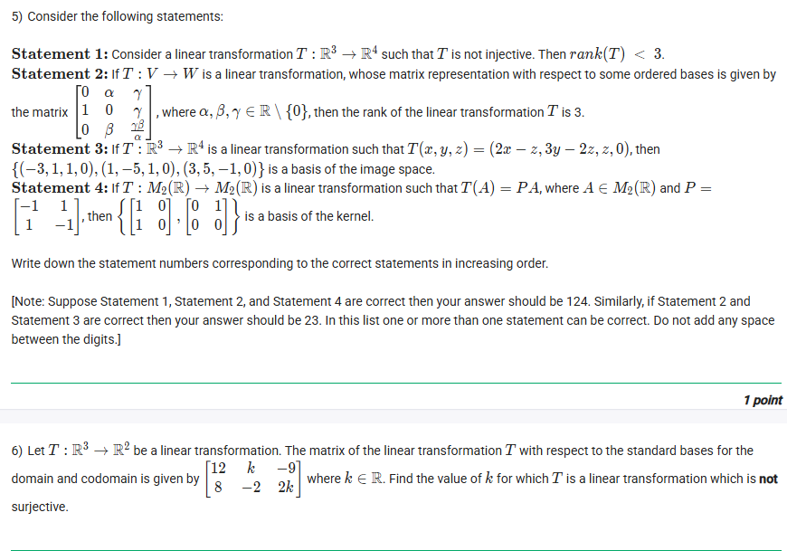

## Exercise Questions ❓

## Exercise Solutions 📖

Of course. Here are the detailed solutions and conceptual explanations for all 10 problems from the images you provided.


### 1. Uniform Distribution on a Circle

**Question:** Let $(X, Y) \sim \text{Uniform}(D)$, where $D = \{(x, y) : (x - 3)^2 + (y - 3)^2 \le 1\}$. Calculate $P(X > Y)$. Enter your answer correct to two decimals accuracy.

---

**Concept:** 🗺️ **Geometric Probability**

When a point $(X, Y)$ is chosen uniformly from a region $D$, the probability of an event $A$ (which corresponds to a sub-region) is the ratio of the areas:

$$P(A) = \frac{\text{Area}(A \cap D)}{\text{Area}(D)}$$

**Detailed Solution:**

1.  **Identify the Region $D$:** The equation $(x - 3)^2 + (y - 3)^2 \le 1$ describes a circle $D$ centered at the point $(3, 3)$ with a radius $r = 1$.
2.  **Calculate $\text{Area}(D)$:** The area of this circle is $\text{Area}(D) = \pi r^2 = \pi(1)^2 = \pi$.
3.  **Identify the Event $A$:** The event is $P(X > Y)$, which can be rewritten as $Y < X$. This corresponds to the region $A$ of the $xy$-plane that lies **below** the line $y = x$.
4.  **Find the $\text{Area}(A \cap D)$:** We need the area of the part of the circle $D$ that is also below the line $y = x$.
5.  **Analyze the Geometry:** Notice that the center of the circle is $(3, 3)$. This point lies *exactly* on the line $y = x$. Any line that passes through the center of a circle divides the circle into two equal semicircles.
    6.  Therefore, the line $y = x$ cuts the circle $D$ into two equal halves. The region $Y < X$ (below the line) represents exactly half of the circle's area.
7.  $\text{Area}(A \cap D) = \frac{1}{2} \times \text{Area}(D) = \frac{\pi}{2}$.
8.  **Calculate the Probability:**
    $$P(X > Y) = \frac{\text{Area}(A \cap D)}{\text{Area}(D)} = \frac{\pi / 2}{\pi} = \frac{1}{2} = 0.5$$

**Answer:** 0.50




### 2. Marginal Density from a Uniform Distribution

**Question:** Let $(X, Y) \sim \text{Uniform}(D)$, where $D = \{(x, y) : y \le 2x, 0 < x < 1, 0 < y < 2\} \cup \{[1, 2] \times [0, 2]\}$. Find the marginal density of $X$, $f_X(x)$.

---

**Concept:** 🧩 **Marginal Density**

1.  **Joint PDF for Uniform:** The joint PDF is $f_{XY}(x, y) = \frac{1}{\text{Area}(D)}$ if $(x, y)$ is in $D$, and 0 otherwise.
2.  **Marginal PDF:** The marginal PDF $f_X(x)$ is found by "integrating out" $y$ from the joint PDF. It tells us the probability distribution of $X$ regardless of $Y$'s value.
    $$f_X(x) = \int_{-\infty}^{\infty} f_{XY}(x, y) \,dy$$

**Detailed Solution:**

1.  **Sketch and Find $\text{Area}(D)$:**
    * **Part 1 ($D_1$):** $0 < x < 1$, $0 < y < 2$, and $y \le 2x$. This forms a triangle with vertices at $(0,0)$, $(1,0)$, and $(1,2)$. The area is $\text{Area}(D_1) = \frac{1}{2} \times \text{base} \times \text{height} = \frac{1}{2} \times 1 \times 2 = 1$.
    * **Part 2 ($D_2$):** $[1, 2] \times [0, 2]$. This is a rectangle with width $(2-1)=1$ and height $(2-0)=2$. The area is $\text{Area}(D_2) = 1 \times 2 = 2$.
    * **Total Area:** $\text{Area}(D) = \text{Area}(D_1) + \text{Area}(D_2) = 1 + 2 = 3$.
2.  **Find the Joint PDF:** $f_{XY}(x, y) = \frac{1}{\text{Area}(D)} = \frac{1}{3}$, for any $(x, y) \in D$.
3.  **Find the Marginal $f_X(x)$:** We must do this in parts, based on the value of $x$.
    * **Case 1: $0 \le x \le 1$** (corresponding to $D_1$)
        In this interval, for a given $x$, $y$ ranges from $0$ up to $2x$.
        $$f_X(x) = \int_0^{2x} f_{XY}(x, y) \,dy = \int_0^{2x} \frac{1}{3} \,dy = \frac{1}{3} [y]_0^{2x} = \frac{1}{3}(2x - 0) = \frac{2x}{3}$$
    * **Case 2: $1 \le x \le 2$** (corresponding to $D_2$)
        In this interval, for a given $x$, $y$ ranges from $0$ up to $2$.
        $$f_X(x) = \int_0^2 f_{XY}(x, y) \,dy = \int_0^2 \frac{1}{3} \,dy = \frac{1}{3} [y]_0^2 = \frac{1}{3}(2 - 0) = \frac{2}{3}$$
    * **Case 3: Otherwise**
        $f_X(x) = 0$.
4.  **Combine the pieces:**
    $f_X(x) = \begin{cases} \frac{2x}{3} & 0 \le x \le 1 \\ \frac{2}{3} & 1 < x \le 2 \\ 0 & \text{otherwise} \end{cases}$

**Answer:** The correct choice is the third option:
$f_X(x) = \begin{cases} \frac{2x}{3} & 0 \le x \le 1 \\ \frac{2}{3} & 1 \le x \le 2 \\ 0 & \text{otherwise} \end{cases}$




### 3. Probability with Independent Exponential Variables

**Question:** The joint pdf of two continuous random variables $X$ and $Y$ is given by $f_{XY}(x, y) = \begin{cases} ke^{-(x+y)} & x \ge 0, y \ge 0 \\ 0 & \text{otherwise} \end{cases}$. Find the value of $P(X \ge 3, Y \le 6)$.

---

**Concept:** 🔗 **Independence**

1.  **Normalization:** The constant $k$ is found by ensuring the total probability is 1: $\iint f_{XY}(x, y) \,dx \,dy = 1$.
2.  **Independence:** Two variables $X$ and $Y$ are independent if their joint PDF $f_{XY}(x, y)$ can be factored into the product of their marginal PDFs: $f_{XY}(x, y) = f_X(x) f_Y(y)$.
3.  **Probability of Independent Events:** If $X$ and $Y$ are independent, $P(A \cap B) = P(A) \times P(B)$. Therefore, $P(X \ge 3, Y \le 6) = P(X \ge 3) \times P(Y \le 6)$.

**Detailed Solution:**

1.  **Find $k$:**
    $$\int_0^\infty \int_0^\infty ke^{-(x+y)} \,dx \,dy = k \left( \int_0^\infty e^{-x} \,dx \right) \left( \int_0^\infty e^{-y} \,dy \right) = 1$$
    The integral $\int_0^\infty e^{-x} \,dx = [-e^{-x}]_0^\infty = (0) - (-1) = 1$.
    So, $k \times (1) \times (1) = 1$, which means $k = 1$.
2.  **Analyze the PDF:** The joint PDF is $f_{XY}(x, y) = e^{-(x+y)} = e^{-x} e^{-y}$.
    This can be factored into $f_X(x) = e^{-x}$ (for $x \ge 0$) and $f_Y(y) = e^{-y}$ (for $y \ge 0$). This confirms $X$ and $Y$ are independent.
3.  **Calculate $P(X \ge 3)$:**
    $$P(X \ge 3) = \int_3^\infty f_X(x) \,dx = \int_3^\infty e^{-x} \,dx = [-e^{-x}]_3^\infty = (0) - (-e^{-3}) = e^{-3}$$
4.  **Calculate $P(Y \le 6)$:**
    $$P(Y \le 6) = \int_0^6 f_Y(y) \,dy = \int_0^6 e^{-y} \,dy = [-e^{-y}]_0^6 = (-e^{-6}) - (-e^0) = 1 - e^{-6}$$
5.  **Calculate the Joint Probability:**
    $$P(X \ge 3, Y \le 6) = P(X \ge 3) \times P(Y \le 6) = e^{-3} (1 - e^{-6})$$

**Answer:** The correct choice is the fourth option: $(1 - e^{-6})e^{-3}$




### 4. Conditional Probability

**Question:** The joint pdf of two random variables $X$ and $Y$ is given by $f_{XY}(x, y) = \begin{cases} \frac{1}{8}(x+y) & 0 < x < 2, 0 < y < 2 \\ 0 & \text{otherwise} \end{cases}$. Find the value of $P(\frac{2}{9} \le Y \le 2 \mid X = \frac{1}{9})$.

---

**Concept:** 📊 **Conditional Density**

To find the probability of $Y$ given a specific value of $X$, we must first find the **conditional probability density function**, $f_{Y|X}(y|x)$.

1.  Find the marginal PDF of $X$: $f_X(x) = \int f_{XY}(x, y) \,dy$
2.  Find the conditional PDF: $f_{Y|X}(y|x) = \frac{f_{XY}(x, y)}{f_X(x)}$
3.  Integrate the conditional PDF over the desired range of $y$: $P(a \le Y \le b \mid X = x_0) = \int_a^b f_{Y|X}(y|x_0) \,dy$

**Detailed Solution:**

1.  **Find $f_X(x)$ (the marginal density of $X$):**
    We integrate the joint PDF with respect to $y$ over its domain $[0, 2]$.
    $$f_X(x) = \int_0^2 \frac{1}{8}(x+y) \,dy = \frac{1}{8} \left[ xy + \frac{y^2}{2} \right]_0^2$$
    $$f_X(x) = \frac{1}{8} \left( (x(2) + \frac{2^2}{2}) - (0) \right) = \frac{1}{8} (2x + 2) = \frac{x+1}{4}$$
    This is valid for $0 < x < 2$.
2.  **Find $f_{Y|X}(y|x)$ (the conditional density of $Y$ given $X$):**
    $$f_{Y|X}(y|x) = \frac{f_{XY}(x, y)}{f_X(x)} = \frac{\frac{1}{8}(x+y)}{\frac{1}{4}(x+1)} = \frac{1}{2} \frac{x+y}{x+1}$$
    This is the formula for the PDF of $Y$, given any value $x$.
3.  **Evaluate at $x = 1/9$:**
    We need the specific PDF for $X = 1/9$.
    $$f_{Y|X}(y|\frac{1}{9}) = \frac{1}{2} \frac{(1/9) + y}{(1/9) + 1} = \frac{1}{2} \frac{(1/9) + y}{10/9} = \frac{1}{2} \frac{9}{10} (y + \frac{1}{9}) = \frac{9}{20}(y + \frac{1}{9})$$
4.  **Calculate the Probability:**
    We integrate this conditional PDF from $y = 2/9$ to $y = 2$.
    $$P(\frac{2}{9} \le Y \le 2 \mid X = \frac{1}{9}) = \int_{2/9}^2 \frac{9}{20}(y + \frac{1}{9}) \,dy$$
    $$= \frac{9}{20} \left[ \frac{y^2}{2} + \frac{y}{9} \right]_{2/9}^2$$
    $$= \frac{9}{20} \left[ \left( \frac{2^2}{2} + \frac{2}{9} \right) - \left( \frac{(2/9)^2}{2} + \frac{2/9}{9} \right) \right]$$
    $$= \frac{9}{20} \left[ \left( 2 + \frac{2}{9} \right) - \left( \frac{4/81}{2} + \frac{2}{81} \right) \right]$$
    $$= \frac{9}{20} \left[ \left( \frac{20}{9} \right) - \left( \frac{2}{81} + \frac{2}{81} \right) \right]$$
    $$= \frac{9}{20} \left[ \frac{20}{9} - \frac{4}{81} \right]$$
    $$= \left( \frac{9}{20} \frac{20}{9} \right) - \left( \frac{9}{20} \frac{4}{81} \right) = 1 - \frac{1}{20} \frac{4}{9} = 1 - \frac{1}{5 \times 9} = 1 - \frac{1}{45} = \frac{44}{45}$$
5.  **Convert to Decimal:** $44 \div 45 \approx 0.9777...$

**Answer:** 0.98




### 5. Probability over a Region

**Question:** The joint density function of two random variables $X$ and $Y$ is $f_{XY}(x, y) = \begin{cases} \frac{2}{3}(x+1) & 0 < x < 1, 0 < y < 1 \\ 0 & \text{otherwise} \end{cases}$. Find the value of $P(X > Y)$.

---

**Concept:** ∬ **Integrating over a Region**

To find the probability of an event (like $X > Y$), you must integrate the joint PDF $f_{XY}(x, y)$ over the region $A$ defined by that event, within the bounds of the PDF's domain $D$.

$$P(A) = \iint_{A \cap D} f_{XY}(x, y) \,dA$$

**Detailed Solution:**

1.  **Identify the Domain $D$:** The domain is the unit square, $[0, 1] \times [0, 1]$.
2.  **Identify the Event Region $A$:** The event is $X > Y$, or $y < x$.
3.  **Identify the Integration Region $A \cap D$:** We need the part of the unit square that is also below the line $y = x$. This is a triangle with vertices $(0,0)$, $(1,0)$, and $(1,1)$.
    4.  **Set up the Double Integral:** We will integrate $f_{XY}(x, y) = \frac{2}{3}(x+1)$ over this triangle. It's easiest to set the outer integral for $x$ and the inner for $y$.
    * $x$ ranges from $0$ to $1$.
    * For any given $x$, $y$ ranges from $0$ up to the line $y=x$.
    $$P(X > Y) = \int_0^1 \left( \int_0^x \frac{2}{3}(x+1) \,dy \right) \,dx$$
5.  **Solve the Inner Integral (with respect to $y$):**
    The term $\frac{2}{3}(x+1)$ is treated as a constant.
    $$\int_0^x \frac{2}{3}(x+1) \,dy = \frac{2}{3}(x+1) [y]_0^x = \frac{2}{3}(x+1)(x - 0) = \frac{2}{3}(x^2 + x)$$
6.  **Solve the Outer Integral (with respect to $x$):**
    $$\int_0^1 \frac{2}{3}(x^2 + x) \,dx = \frac{2}{3} \left[ \frac{x^3}{3} + \frac{x^2}{2} \right]_0^1$$
    $$= \frac{2}{3} \left[ \left( \frac{1^3}{3} + \frac{1^2}{2} \right) - (0) \right] = \frac{2}{3} \left( \frac{1}{3} + \frac{1}{2} \right)$$
    $$= \frac{2}{3} \left( \frac{2}{6} + \frac{3}{6} \right) = \frac{2}{3} \left( \frac{5}{6} \right) = \frac{10}{18} = \frac{5}{9}$$
7.  **Convert to Decimal:** $5 \div 9 = 0.5555...$

**Answer:** 0.56




### 6. Finding the Normalization Constant

**Question:** The joint density function of two random variables $X$ and $Y$ is given by $f(x, y) = \begin{cases} k(x+2y) & \text{for } 0 < x < 1, 1 < y < 2 \\ 0 & \text{otherwise} \end{cases}$. Find the value of $k$.

---

**Concept:** ⚖️ **Normalization**

A probability density function (PDF) must "contain" a total probability of 1. This means the integral of the PDF over its entire domain must equal 1.

$$\int_{-\infty}^{\infty} \int_{-\infty}^{\infty} f(x, y) \,dx \,dy = 1$$

**Detailed Solution:**

1.  **Set up the Integral:** We set the double integral of the PDF over its given domain equal to 1.
    $$\int_1^2 \left( \int_0^1 k(x+2y) \,dx \right) \,dy = 1$$
2.  **Solve the Inner Integral (with respect to $x$):**
    $$k \int_1^2 \left[ \frac{x^2}{2} + 2yx \right]_0^1 \,dy$$
    $$= k \int_1^2 \left( (\frac{1^2}{2} + 2y(1)) - (0) \right) \,dy = k \int_1^2 (\frac{1}{2} + 2y) \,dy$$
3.  **Solve the Outer Integral (with respect to $y$):**
    $$k \left[ \frac{1}{2}y + y^2 \right]_1^2 = 1$$
    $$k \left[ (\frac{1}{2}(2) + 2^2) - (\frac{1}{2}(1) + 1^2) \right] = 1$$
    $$k \left[ (1 + 4) - (\frac{1}{2} + 1) \right] = 1$$
    $$k \left[ 5 - \frac{3}{2} \right] = 1$$
    $$k \left[ \frac{10}{2} - \frac{3}{2} \right] = 1$$
    $$k \left( \frac{7}{2} \right) = 1$$
4.  **Solve for $k$:**
    $$k = \frac{2}{7}$$
5.  **Convert to Decimal:** $2 \div 7 \approx 0.285714...$

**Answer:** 0.286




### 7. Conditional Probability

**Question:** Let $X$ and $Y$ be two continuous random variables with joint PDF $f_{XY}(x, y) = \begin{cases} xe^{-x(y+1)} & x > 0, y > 0 \\ 0 & \text{otherwise} \end{cases}$. Find the value of $P(Y > 2 \mid X > 1)$.

---

**Concept:** 📋 **Conditional Probability Formula**

The definition of conditional probability is:
$$P(A \mid B) = \frac{P(A \cap B)}{P(B)}$$
In this case, $A = \{Y > 2\}$ and $B = \{X > 1\}$. So, we need to find:
$$P(Y > 2 \mid X > 1) = \frac{P(Y > 2 \text{ and } X > 1)}{P(X > 1)}$$

**Detailed Solution:**

1.  **Calculate the numerator, $P(Y > 2, X > 1)$:**
    We integrate the joint PDF over the region $x > 1$ and $y > 2$.
    $$\int_1^\infty \left( \int_2^\infty xe^{-x(y+1)} \,dy \right) \,dx = \int_1^\infty \left( \int_2^\infty xe^{-xy}e^{-x} \,dy \right) \,dx$$
    Let's solve the inner integral (w.r.t $y$) first:
    $$\int_2^\infty xe^{-x}e^{-xy} \,dy = xe^{-x} \left[ \frac{e^{-xy}}{-x} \right]_2^\infty$$
    $$= xe^{-x} \left( (0) - (\frac{e^{-x(2)}}{-x}) \right) = xe^{-x} \left( \frac{e^{-2x}}{x} \right) = e^{-x}e^{-2x} = e^{-3x}$$
    Now solve the outer integral (w.r.t $x$):
    $$\int_1^\infty e^{-3x} \,dx = \left[ \frac{e^{-3x}}{-3} \right]_1^\infty = (0) - (\frac{e^{-3(1)}}{-3}) = \frac{e^{-3}}{3}$$
    So, $P(Y > 2, X > 1) = \frac{e^{-3}}{3}$.

2.  **Calculate the denominator, $P(X > 1)$:**
    First, we need the marginal PDF $f_X(x)$ by integrating $f_{XY}$ w.r.t $y$ over its full domain $(0, \infty)$.
    $$f_X(x) = \int_0^\infty xe^{-x(y+1)} \,dy = \int_0^\infty xe^{-xy}e^{-x} \,dy$$
    $$= xe^{-x} \int_0^\infty e^{-xy} \,dy = xe^{-x} \left[ \frac{e^{-xy}}{-x} \right]_0^\infty$$
    $$= xe^{-x} \left( (0) - (\frac{e^0}{-x}) \right) = xe^{-x} \left( \frac{1}{x} \right) = e^{-x}$$
    (So, $X$ is an exponential variable with $\lambda=1$).
    Now, find $P(X > 1)$:
    $$P(X > 1) = \int_1^\infty f_X(x) \,dx = \int_1^\infty e^{-x} \,dx = [-e^{-x}]_1^\infty = (0) - (-e^{-1}) = e^{-1}$$

3.  **Calculate the Final Probability:**
    $$P(Y > 2 \mid X > 1) = \frac{P(Y > 2, X > 1)}{P(X > 1)} = \frac{e^{-3} / 3}{e^{-1}} = \frac{1}{3} e^{-3} e^1 = \frac{1}{3}e^{-2}$$

**Answer:** The correct choice is the second option: $\frac{1}{3}e^{-2}$




### 8. Probability over a Triangular Region

**Question:** At a particular bakery, ... $f_{XY}(x, y) = \begin{cases} cxy & \text{if } 0 \le y \le x \le 2 \\ 0 & \text{otherwise} \end{cases}$. Find the probability that the amount of dough used ($Y$) ... is less than half the amount prepared ($X$).

---

**Concept:** 1. Normalization, 2. Probability Calculation
This is a two-step problem.
1.  **Find $c$:** Use the normalization rule $\iint f_{XY}(x, y) \,dA = 1$ over the domain $D$.
2.  **Find Probability:** The question asks for $P(Y < X/2)$. We must integrate the now-known PDF, $f_{XY}(x, y)$, over the event region $A = \{Y < X/2\}$ (intersected with $D$).

**Detailed Solution:**

1.  **Identify Domain $D$:** The domain $D$ is $0 \le y \le x \le 2$. This is a triangle with vertices $(0,0)$, $(2,0)$, and $(2,2)$.
2.  **Find $c$:**
    $$\int_0^2 \left( \int_0^x cxy \,dy \right) \,dx = 1$$
    Inner integral (w.r.t $y$): $c \int_0^2 x \left[ \frac{y^2}{2} \right]_0^x \,dx = c \int_0^2 x (\frac{x^2}{2}) \,dx = c \int_0^2 \frac{x^3}{2} \,dx$
    Outer integral (w.r.t $x$): $\frac{c}{2} \left[ \frac{x^4}{4} \right]_0^2 = \frac{c}{8} (2^4 - 0) = \frac{c}{8} (16) = 2c$.
    Since $2c = 1$, we have $c = \frac{1}{2}$. The PDF is $f_{XY}(x, y) = \frac{1}{2}xy$.

3.  **Find $P(Y < X/2)$:**
    We must integrate $f_{XY}(x, y) = \frac{1}{2}xy$ over the region $A \cap D$.
    * $D$ is $0 \le y \le x \le 2$.
    * $A$ is $y < x/2$.
    The combined region is $0 \le y \le x/2$ and $0 \le x \le 2$. (The condition $y \le x/2$ automatically satisfies $y \le x$, since $x/2 < x$ for $x>0$).
4.  **Set up the Integral:**
    $$P(Y < X/2) = \int_0^2 \left( \int_0^{x/2} \frac{1}{2}xy \,dy \right) \,dx$$
5.  **Solve the Inner Integral (w.r.t $y$):**
    $$\frac{1}{2} \int_0^2 x \left[ \frac{y^2}{2} \right]_0^{x/2} \,dx = \frac{1}{2} \int_0^2 x \left( \frac{(x/2)^2}{2} - 0 \right) \,dx$$
    $$= \frac{1}{2} \int_0^2 x \left( \frac{x^2/4}{2} \right) \,dx = \frac{1}{2} \int_0^2 \frac{x^3}{8} \,dx = \frac{1}{16} \int_0^2 x^3 \,dx$$
6.  **Solve the Outer Integral (w.r.t $x$):**
    $$\frac{1}{16} \left[ \frac{x^4}{4} \right]_0^2 = \frac{1}{64} (2^4 - 0) = \frac{16}{64} = \frac{1}{4}$$

**Answer:** 0.25




### 9. Conditional Probability (Independent Variables)

**Question:** ... The joint probability density function of $X$ and $Y$ is given by $f_{XY}(x, y) = \begin{cases} \frac{x^3y}{k} & 0 < x < 1, 0 < y < 2 \\ 0 & \text{otherwise} \end{cases}$. If a patient is known to have received a 0.5 ml dose ($X=0.5$), what is the probability that the duration of relief lies between 0.5 and 1.5 hours ($0.5 \le Y \le 1.5$)?

---

**Concept:** Conditional Probability & Independence

This problem asks for $P(0.5 \le Y \le 1.5 \mid X = 0.5)$. We can solve this using the conditional density $f_{Y|X}(y|x)$, just like in problem 4. However, we should first check if $X$ and $Y$ are independent.

**Detailed Solution:**

1.  **Find $k$:**
    $$\int_0^1 \int_0^2 \frac{x^3y}{k} \,dy \,dx = 1$$
    $$\frac{1}{k} \left( \int_0^1 x^3 \,dx \right) \left( \int_0^2 y \,dy \right) = 1$$
    $$\frac{1}{k} \left[ \frac{x^4}{4} \right]_0^1 \left[ \frac{y^2}{2} \right]_0^2 = 1$$
    $$\frac{1}{k} \left( \frac{1}{4} \right) \left( \frac{4}{2} \right) = 1 \implies \frac{1}{k} \left( \frac{1}{2} \right) = 1 \implies k = \frac{1}{2}$$
2.  **Analyze the PDF:** The joint PDF is $f_{XY}(x, y) = 2x^3y$.
    The domain is a rectangle $[0, 1] \times [0, 2]$.
    The function $2x^3y$ can be factored into a function of $x$ and a function of $y$: $f_{XY}(x, y) = (4x^3) \times (\frac{y}{2})$.
    (We can find these marginals: $f_X(x) = \int_0^2 2x^3y \,dy = 2x^3 [\frac{y^2}{2}]_0^2 = 4x^3$. And $f_Y(y) = \int_0^1 2x^3y \,dx = 2y [\frac{x^4}{4}]_0^1 = \frac{y}{2}$. Since $f_X(x)f_Y(y) = (4x^3)(\frac{y}{2}) = 2x^3y = f_{XY}(x, y)$, the variables are **independent**.)
3.  **Calculate the Probability:**
    Because $X$ and $Y$ are independent, the condition $X=0.5$ provides no information about $Y$.
    $$P(0.5 \le Y \le 1.5 \mid X = 0.5) = P(0.5 \le Y \le 1.5)$$
    We can find this using the marginal PDF for $Y$, which we found to be $f_Y(y) = \frac{y}{2}$ for $0 < y < 2$.
    $$P(0.5 \le Y \le 1.5) = \int_{0.5}^{1.5} f_Y(y) \,dy = \int_{0.5}^{1.5} \frac{y}{2} \,dy$$
    $$= \frac{1}{2} \left[ \frac{y^2}{2} \right]_{0.5}^{1.5} = \frac{1}{4} [y^2]_{0.5}^{1.5}$$
    $$= \frac{1}{4} (1.5^2 - 0.5^2) = \frac{1}{4} (2.25 - 0.25) = \frac{1}{4} (2) = \frac{1}{2}$$

**Answer:** 0.5




### 10. Uniform Distribution on a Rectangle

**Question:** Let $(X, Y) \sim \text{Uniform}(D)$, where $D := [0, 5] \times [0, 2]$. Find $P(X + Y < 4)$. Enter the answer correct to one decimal place.

---

**Concept:** 🗺️ **Geometric Probability**

Just like in problem 1, the probability is the ratio of the areas.
$$P(A) = \frac{\text{Area}(A \cap D)}{\text{Area}(D)}$$

**Detailed Solution:**

1.  **Identify the Region $D$:** This is a rectangle with vertices $(0,0)$, $(5,0)$, $(5,2)$, and $(0,2)$.
2.  **Calculate $\text{Area}(D)$:** $\text{Area}(D) = \text{width} \times \text{height} = 5 \times 2 = 10$.
3.  **Identify the Event $A$:** The event is $X + Y < 4$, which can be rewritten as $Y < 4 - X$. This is the region below the line $y = 4 - x$.
4.  **Find $\text{Area}(A \cap D)$:** We need to find the area of the rectangle $D$ that is *also* below the line $y = 4 - x$.
    * Let's sketch the line $y = 4 - x$. It hits the $x$-axis at $(4,0)$ and the $y$-axis at $(0,4)$.
    * Let's see where this line intersects the boundaries of our rectangle $D$:
        * Boundary $y=0$: The line hits at $x=4$. (The point $(4,0)$ is on the edge of $D$).
        * Boundary $y=2$: The line hits at $2 = 4 - x \implies x = 2$. (The point $(2,2)$ is on the edge of $D$).
    * The region $A \cap D$ is the part of the rectangle bounded by $x=0$, $y=0$ and the line $y = 4-x$ (and the top boundary $y=2$).
    * x[0,2] with the line y=4-x, showing the area of interest]
    * The resulting shape is a polygon with vertices $(0,0)$, $(4,0)$, $(2,2)$, and $(0,2)$.
5.  **Calculate the Area of the Polygon:** We can split this polygon into a rectangle and a triangle.
    * **Rectangle:** From $x=0$ to $x=2$, the region is bounded by $y=0$ and $y=2$. $\text{Area} = 2 \times 2 = 4$.
    * **Triangle:** From $x=2$ to $x=4$, the region is a triangle with vertices $(2,0)$, $(4,0)$, and $(2,2)$. $\text{Area} = \frac{1}{2} \times \text{base} \times \text{height} = \frac{1}{2} \times (4-2) \times 2 = 2$.
    * **Total Area:** $\text{Area}(A \cap D) = 4 + 2 = 6$.
    * (Note: For $x > 4$, the line $y = 4-x$ is below $y=0$, so none of that area is counted).
6.  **Calculate the Probability:**
    $$P(X + Y < 4) = \frac{\text{Area}(A \cap D)}{\text{Area}(D)} = \frac{6}{10} = 0.6$$

**Answer:** 0.6

