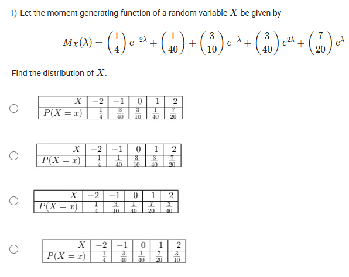
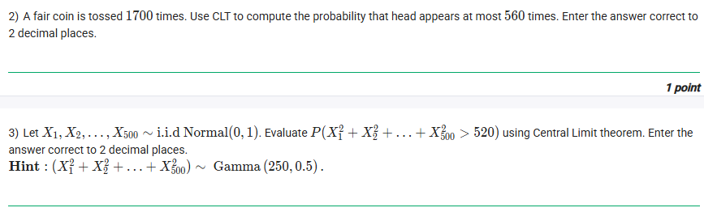
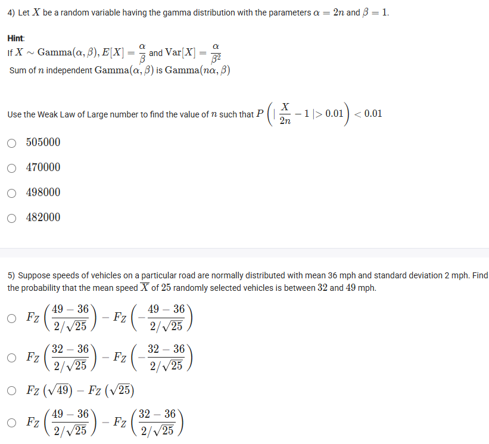
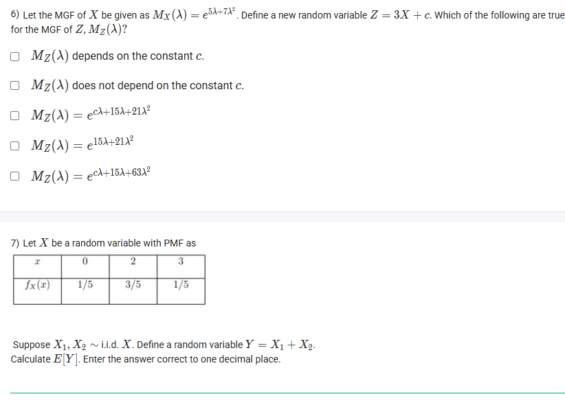
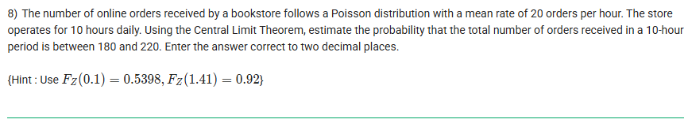
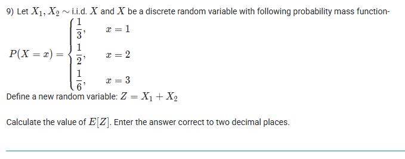
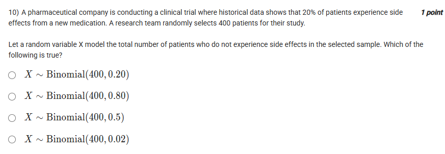
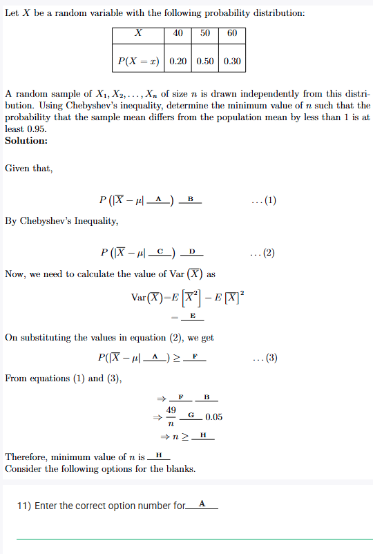
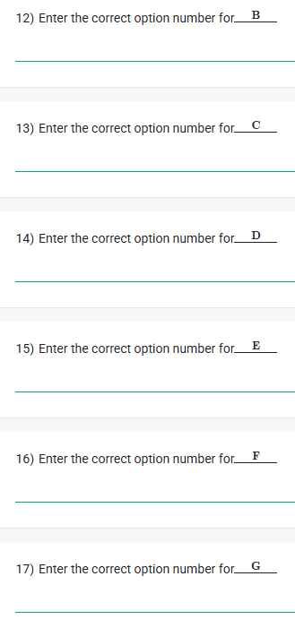
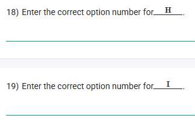

## Exercise Questions ❓

## Exercise Solutions 🟩

Here are the detailed solutions and concept explanations for each question you provided.



## ❓ Question 1

**Problem:** Let the moment generating function (MGF) of a random variable $X$ be given by:
$$M_X(\lambda) = \left(\frac{1}{4}\right)e^{-2\lambda} + \left(\frac{1}{40}\right) + \left(\frac{3}{10}\right)e^{-\lambda} + \left(\frac{3}{40}\right)e^{2\lambda} + \left(\frac{7}{20}\right)e^{\lambda}$$
Find the distribution of $X$.

**Concepts:**
The **Moment Generating Function (MGF)** for a **discrete random variable** $X$ is a unique signature of its probability distribution. It's defined as:
$$M_X(\lambda) = E[e^{\lambda X}]$$
If $X$ can take values $x_1, x_2, \ldots, x_k$ with probabilities $p_1, p_2, \ldots, p_k$ (where $p_i = P(X=x_i)$), the MGF is:
$$M_X(\lambda) = \sum_{i=1}^{k} p_i e^{\lambda x_i}$$
To find the distribution, we just need to match the terms in the given MGF to this standard form. Each term $(p_i)e^{\lambda x_i}$ tells us that $P(X = x_i) = p_i$.

**Solution:**
1.  **Write down the given MGF:**
    $$M_X(\lambda) = \left(\frac{1}{4}\right)e^{-2\lambda} + \left(\frac{1}{40}\right) + \left(\frac{3}{10}\right)e^{-\lambda} + \left(\frac{3}{40}\right)e^{2\lambda} + \left(\frac{7}{20}\right)e^{\lambda}$$
2.  **Rewrite the MGF** by ordering the terms by the exponent (the value of $x_i$) from smallest to largest. Remember that a constant term like $\frac{1}{40}$ is just $\frac{1}{40}e^{0\lambda}$.
    * $e^{-2\lambda}$ term: $\left(\frac{1}{4}\right)e^{\lambda(-2)}$
    * $e^{-\lambda}$ term: $\left(\frac{3}{10}\right)e^{\lambda(-1)}$
    * Constant term: $\left(\frac{1}{40}\right)e^{\lambda(0)}$
    * $e^{\lambda}$ term: $\left(\frac{7}{20}\right)e^{\lambda(1)}$
    * $e^{2\lambda}$ term: $\left(\frac{3}{40}\right)e^{\lambda(2)}$
3.  **Match coefficients ($p_i$) to values ($x_i$):**
    * From $\left(\frac{1}{4}\right)e^{\lambda(-2)}$, we see $P(X = -2) = \frac{1}{4}$.
    * From $\left(\frac{3}{10}\right)e^{\lambda(-1)}$, we see $P(X = -1) = \frac{3}{10}$.
    * From $\left(\frac{1}{40}\right)e^{\lambda(0)}$, we see $P(X = 0) = \frac{1}{40}$.
    * From $\left(\frac{7}{20}\right)e^{\lambda(1)}$, we see $P(X = 1) = \frac{7}{20}$.
    * From $\left(\frac{3}{40}\right)e^{\lambda(2)}$, we see $P(X = 2) = \frac{3}{40}$.
4.  **Construct the probability distribution table (PMF):**
| $X$ | $-2$ | $-1$ | $0$ | $1$ | $2$ |
| :--- | :---: | :---: | :---: | :---: | :---: |
| $P(X=x)$ | $\frac{1}{4}$ | $\frac{3}{10}$ | $\frac{1}{40}$ | $\frac{7}{20}$ | $\frac{3}{40}$ |
5.  **Compare** this table to the options provided in the image. This table matches the **third option**.

---

**Answer:** The correct distribution is given by the third option:

| $X$ | $-2$ | $-1$ | $0$ | $1$ | $2$ |
| :--- | :---: | :---: | :---: | :---: | :---: |
| $P(X=x)$ | $\frac{1}{4}$ | $\frac{3}{10}$ | $\frac{1}{40}$ | $\frac{7}{20}$ | $\frac{3}{40}$ |





## ❓ Question 2

**Problem:** A fair coin is tossed 1700 times. Use CLT to compute the probability that head appears at most 560 times. Enter the answer correct to 2 decimal places.

**Concepts:**
1.  **Binomial Distribution:** The number of heads (successes) $S_n$ in $n$ independent coin tosses (trials) follows a Binomial distribution, $S_n \sim \text{Bin}(n, p)$. Here $n = 1700$ and $p = 0.5$ (since the coin is fair).
2.  **Central Limit Theorem (CLT):** For a large $n$, the Binomial distribution $\text{Bin}(n, p)$ can be approximated by a Normal distribution $N(\mu, \sigma^2)$ with:
    * Mean: $\mu = np$
    * Variance: $\sigma^2 = np(1-p)$
3.  **Continuity Correction:** When approximating a discrete distribution (Binomial, which uses integers) with a continuous one (Normal, which uses all real numbers), we must use a continuity correction. To find the probability of "at most 560" (which is $P(S_n \le 560)$), we must include the entire integer "bar" for 560. We do this by extending the range to 560.5. The rule is: $P(S_n \le k) \approx P(Y \le k+0.5)$.

**Solution:**
1.  **Identify parameters:**
    * Number of trials, $n = 1700$
    * Probability of success (heads), $p = 0.5$
2.  **Find the mean and variance** of the approximating Normal distribution:
    * Mean: $\mu = np = 1700 \times 0.5 = 850$.
    * Variance: $\sigma^2 = np(1-p) = 1700 \times 0.5 \times 0.5 = 425$.
    * Standard Deviation: $\sigma = \sqrt{425} \approx 20.616$.
3.  **State the problem:** We want to find $P(S_n \le 560)$.
4.  **Apply continuity correction:**
    * We approximate $P(S_n \le 560)$ with $P(Y \le 560.5)$, where $Y \sim N(850, 425)$.
5.  **Standardize** the value 560.5 by calculating its Z-score:
    $$Z = \frac{Y - \mu}{\sigma}$$
    $$z = \frac{560.5 - 850}{\sqrt{425}} = \frac{-289.5}{20.616} \approx -14.04$$
6.  **Find the probability:**
    * We need to find $P(Z \le -14.04)$.
    * A Z-score of -14.04 is extremely far to the left of the mean (0). Standard Z-tables typically only go up to -3.5 or -4.0, at which point the probability is already $0.0002$ or $0.00003$.
    * A Z-score of -14.04 means the value is 14 standard deviations below the mean. The probability of this is virtually zero.

---

**Answer:**
The probability is $P(Z \le -14.04) \approx 0$.
Correct to 2 decimal places, the answer is **0.00**.





## ❓ Question 3

**Problem:** Let $X_1, \ldots, X_{500} \sim i.i.d \text{ Normal}(0, 1)$. Evaluate $P(X_1^2 + \ldots + X_{500}^2 > 520)$ using Central Limit theorem. Enter the answer correct to 2 decimal places.
**Hint:** $(X_1^2 + \ldots + X_{500}^2) \sim \text{Gamma}(250, 0.5)$.

**Concepts:**
1.  **Central Limit Theorem (CLT):** The CLT states that the sum of a large number $n$ of independent and identically distributed (i.i.d.) random variables will be approximately normally distributed, regardless of the original distribution.
2.  **Chi-Squared Distribution:** The square of a standard normal variable, $X_i^2$, follows a Chi-squared distribution with 1 degree of freedom, $\chi^2(1)$.
3.  **Sum of variables:** We are asked to find the probability of a sum, $S = Y_1 + \ldots + Y_{500}$, where each $Y_i = X_i^2$.
4.  **Mean and Variance of $\chi^2(1)$:** A $\chi^2(k)$ distribution has mean $k$ and variance $2k$.
    * Therefore, our $Y_i \sim \chi^2(1)$ has:
    * $E[Y_i] = 1$
    * $Var(Y_i) = 2$

**Solution:**
1.  **Define the sum:** We are interested in the sum $S = \sum_{i=1}^{500} Y_i$, where $Y_i = X_i^2$. We have 500 i.i.d. variables $Y_i$.
2.  **Apply CLT:** According to the CLT, the sum $S$ will be approximately normally distributed: $S \approx N(\mu_S, \sigma_S^2)$.
3.  **Find the mean and variance of the sum $S$:**
    * Mean: $\mu_S = n \times E[Y_i] = 500 \times 1 = 500$.
    * Variance: $\sigma_S^2 = n \times Var(Y_i) = 500 \times 2 = 1000$.
    * Standard Deviation: $\sigma_S = \sqrt{1000} \approx 31.62$.
    * (This matches the hint: $\text{Gamma}(\alpha=250, \beta=0.5 \text{ rate})$ has mean $\alpha/\beta = 250/0.5 = 500$ and variance $\alpha/\beta^2 = 250/(0.5^2) = 1000$.)
4.  **State the problem:** We need to find $P(S > 520)$. We will use our normal approximation $N(500, 1000)$.
5.  **Standardize** the value 520:
    $$Z = \frac{S - \mu_S}{\sigma_S}$$
    $$z = \frac{520 - 500}{\sqrt{1000}} = \frac{20}{31.62} \approx 0.632$$
6.  **Find the probability:**
    * We need to find $P(Z > 0.632)$.
    * Using a standard Z-table, $P(Z \le 0.63) = 0.7357$.
    * $P(Z > 0.63) = 1 - P(Z \le 0.63) = 1 - 0.7357 = 0.2643$.
7.  **Format the answer:** The question asks for the answer correct to 2 decimal places.
    $0.2643 \approx 0.26$.

---

**Answer:**
The probability is **0.26**.





## ❓ Question 4

**Problem:** Let $X$ be a random variable having the gamma distribution with $\alpha = 2n$ and $\beta = 1$. Use the Weak Law of Large Numbers (WLLN) to find the value of $n$ such that $P\left(\left|\frac{X}{2n} - 1\right| > 0.01\right) < 0.01$.

**Hint:** If $Y \sim \text{Gamma}(\alpha, \beta)$, $E[Y] = \alpha/\beta$ and $Var[Y] = \alpha/\beta^2$. Sum of $n$ independent $\text{Gamma}(\alpha, \beta)$ is $\text{Gamma}(n\alpha, \beta)$.

**Concepts:**
1.  **Weak Law of Large Numbers (WLLN):** This law relates to the convergence of a sample mean $\bar{X}_n$ to the population mean $\mu$. The hint about the sum of Gamma variables suggests we should re-frame $X$ as a sum.
2.  **Chebyshev's Inequality:** This is the tool used to find a bound for the WLLN. For any random variable $Y$ with mean $\mu_Y$ and variance $\sigma_Y^2$, and any $\epsilon > 0$:
    $$P(|Y - \mu_Y| > \epsilon) \le \frac{\sigma_Y^2}{\epsilon^2}$$
    We are asked to find $n$ such that this probability is less than 0.01. We can do this by finding the $n$ that makes the *bound* equal to 0.01.

**Solution:**
1.  **Re-frame $X$ as a sum:**
    * We are given $X \sim \text{Gamma}(\alpha=2n, \beta=1)$.
    * Using the hint, we can express $X$ as the sum of $n$ i.i.d. variables, $X = \sum_{i=1}^{n} X_i$.
    * If $X \sim \text{Gamma}(n\alpha, \beta)$, we must have $n\alpha = 2n$ and $\beta=1$. This implies $\alpha=2$.
    * So, we can model $X$ as the sum of $n$ variables $X_i$, where each $X_i \sim \text{Gamma}(\alpha=2, \beta=1)$.
2.  **Find Mean and Variance of $X_i$:**
    * $E[X_i] = \alpha/\beta = 2/1 = 2$.
    * $Var(X_i) = \alpha/\beta^2 = 2/1^2 = 2$.
3.  **Rewrite the probability expression:**
    * We are interested in the term $\frac{X}{2n}$.
    * $\frac{X}{2n} = \frac{\sum X_i}{2n} = \frac{1}{2} \left( \frac{\sum X_i}{n} \right) = \frac{1}{2}\bar{X}_n$, where $\bar{X}_n$ is the sample mean.
    * The probability becomes: $P\left(\left|\frac{1}{2}\bar{X}_n - 1\right| > 0.01\right)$.
    * The mean of $\bar{X}_n$ is $E[\bar{X}_n] = E[X_i] = 2$. Let's factor out $\frac{1}{2}$ to get the standard WLLN form:
    * $P\left(\frac{1}{2}\left|\bar{X}_n - 2\right| > 0.01\right) = P\left(\left|\bar{X}_n - 2\right| > 0.02\right)$.
4.  **Apply Chebyshev's Inequality:**
    * We now have the form $P(|\bar{X}_n - \mu| > \epsilon) < \delta$, where:
        * $\mu = E[X_i] = 2$
        * $\epsilon = 0.02$
        * $\delta = 0.01$
    * Chebyshev's Inequality states: $P(|\bar{X}_n - \mu| > \epsilon) \le \frac{Var(\bar{X}_n)}{\epsilon^2}$.
    * We need to find $Var(\bar{X}_n)$: $Var(\bar{X}_n) = \frac{Var(X_i)}{n} = \frac{2}{n}$.
    * So, $P(|\bar{X}_n - 2| > 0.02) \le \frac{2/n}{(0.02)^2}$.
5.  **Solve for $n$:**
    * We want to find $n$ such that the probability is $< 0.01$. We set the upper bound to be equal to $0.01$ to find the minimum $n$. (Any $n$ larger than this will also satisfy the inequality).
    * $\frac{2/n}{(0.02)^2} = 0.01$
    * $\frac{2/n}{0.0004} = 0.01$
    * $\frac{2}{0.0004 n} = 0.01$
    * $\frac{5000}{n} = 0.01$
    * $5000 = 0.01 n$
    * $n = \frac{5000}{0.01} = 500,000$.
6.  **Interpret the result:**
    * This $n=500,000$ is the boundary value. To make the probability *strictly less than* 0.01, we need $n$ to be *strictly greater than* 500,000.
    * Looking at the options: {505000, 470000, 498000, 482000}.
    * The only option that satisfies $n > 500,000$ is 505000.

---

**Answer:**
The correct value for $n$ from the options is **505000**.





## ❓ Question 5

**Problem:** Suppose speeds of vehicles on a particular road are normally distributed with mean 36 mph and standard deviation 2 mph. Find the probability that the mean speed $\bar{X}$ of 25 randomly selected vehicles is between 32 and 49 mph.

**Concepts:**
**Sampling Distribution of the Sample Mean:**
If a population is normally distributed as $X \sim N(\mu, \sigma^2)$, then the distribution of the sample mean $\bar{X}$ for a sample of size $n$ is also normally distributed:
$$\bar{X} \sim N\left(\mu, \frac{\sigma^2}{n}\right)$$
The mean of the sample mean ($\mu_{\bar{X}}$) is the same as the population mean ($\mu$).
The standard deviation of the sample mean ($\sigma_{\bar{X}}$), also called the **standard error**, is $\sigma_{\bar{X}} = \frac{\sigma}{\sqrt{n}}$.

**Solution:**
1.  **Identify population and sample parameters:**
    * Population Mean $\mu = 36$
    * Population Standard Deviation $\sigma = 2$
    * Sample Size $n = 25$
2.  **Determine the distribution of the sample mean $\bar{X}$:**
    * Mean of $\bar{X}$: $\mu_{\bar{X}} = \mu = 36$.
    * Standard Error of $\bar{X}$: $\sigma_{\bar{X}} = \frac{\sigma}{\sqrt{n}} = \frac{2}{\sqrt{25}} = \frac{2}{5}$.
    * So, $\bar{X} \sim N(36, (2/5)^2)$.
3.  **Set up the probability statement:**
    * We want to find $P(32 < \bar{X} < 49)$.
    * This can be written as $P(\bar{X} \le 49) - P(\bar{X} \le 32)$.
4.  **Standardize the values:**
    * To find $P(\bar{X} \le x)$, we calculate the Z-score: $Z = \frac{x - \mu_{\bar{X}}}{\sigma_{\bar{X}}} = \frac{x - 36}{2 / \sqrt{25}}$.
    * The probability is $P(Z \le z)$, which is denoted by the CDF $F_Z(z)$.
5.  **Apply to our two boundaries:**
    * For $x = 49$: $P(\bar{X} \le 49) = F_Z\left( \frac{49 - 36}{2 / \sqrt{25}} \right)$
    * For $x = 32$: $P(\bar{X} \le 32) = F_Z\left( \frac{32 - 36}{2 / \sqrt{25}} \right)$
6.  **Combine the terms:**
    $$P(32 < \bar{X} < 49) = F_Z\left( \frac{49 - 36}{2 / \sqrt{25}} \right) - F_Z\left( \frac{32 - 36}{2 / \sqrt{25}} \right)$$
7.  **Compare** this expression to the given options. It matches the last option.

---

**Answer:** The correct expression is the last one:
$$F_Z\left( \frac{49 - 36}{2 / \sqrt{25}} \right) - F_Z\left( \frac{32 - 36}{2 / \sqrt{25}} \right)$$





## ❓ Question 6

**Problem:** Let the MGF of $X$ be given as $M_X(\lambda) = e^{5\lambda + 7\lambda^2}$. Define a new random variable $Z = 3X + c$. Which of the following are true for the MGF of $Z$, $M_Z(\lambda)$?
* $M_Z(\lambda)$ depends on the constant $c$.
* $M_Z(\lambda)$ does not depend on the constant $c$.
* $M_Z(\lambda) = e^{c\lambda + 15\lambda + 21\lambda^2}$
* $M_Z(\lambda) = e^{15\lambda + 21\lambda^2}$
* $M_Z(\lambda) = e^{c\lambda + 15\lambda + 63\lambda^2}$

**Concepts:**
**Properties of MGFs (Linear Transformation):**
A key property of MGFs relates to linear transformations. If $Y = aX + b$, its MGF $M_Y(\lambda)$ can be found from $M_X(\lambda)$ as follows:
$$M_Y(\lambda) = E[e^{\lambda Y}] = E[e^{\lambda(aX + b)}] = E[e^{a\lambda X} \cdot e^{b\lambda}]$$
Since $e^{b\lambda}$ is a constant with respect to $X$, we can pull it out:
$$M_Y(\lambda) = e^{b\lambda} E[e^{(a\lambda)X}]$$
By the definition of MGF, $E[e^{(a\lambda)X}] = M_X(a\lambda)$.
Therefore, the property is: **$M_{aX+b}(\lambda) = e^{b\lambda} M_X(a\lambda)$**

**Solution:**
1.  **Identify the transformation:** We have $Z = 3X + c$.
    * This matches $aX+b$ with $a = 3$ and $b = c$.
2.  **Apply the MGF property:**
    * $M_Z(\lambda) = M_{3X+c}(\lambda) = e^{c\lambda} M_X(3\lambda)$.
3.  **Find the term $M_X(3\lambda)$:**
    * We are given $M_X(\lambda) = e^{5\lambda + 7\lambda^2}$.
    * To find $M_X(3\lambda)$, we substitute $(3\lambda)$ everywhere we see $\lambda$:
    * $M_X(3\lambda) = e^{5(3\lambda) + 7(3\lambda)^2}$
    * $M_X(3\lambda) = e^{15\lambda + 7(9\lambda^2)}$
    * $M_X(3\lambda) = e^{15\lambda + 63\lambda^2}$
4.  **Combine the parts** to find $M_Z(\lambda)$:
    * $M_Z(\lambda) = e^{c\lambda} \times M_X(3\lambda)$
    * $M_Z(\lambda) = e^{c\lambda} \times e^{15\lambda + 63\lambda^2}$
    * When multiplying exponentials, we add the exponents:
    * $M_Z(\lambda) = e^{c\lambda + 15\lambda + 63\lambda^2}$
5.  **Evaluate the options:**
    * **$M_Z(\lambda)$ depends on the constant $c$:** **True**. The term $c\lambda$ is clearly in the final expression.
    * **$M_Z(\lambda)$ does not depend on the constant $c$:** **False**.
    * **$M_Z(\lambda) = e^{c\lambda + 15\lambda + 21\lambda^2}$:** **False**. The coefficient of $\lambda^2$ is 63, not 21. (This error comes from $7 \times 3$ instead of $7 \times 3^2$).
    * **$M_Z(\lambda) = e^{15\lambda + 21\lambda^2}$:** **False**.
    * **$M_Z(\lambda) = e^{c\lambda + 15\lambda + 63\lambda^2}$:** **True**. This exactly matches our result.

---

**Answer:**
There are two true statements:
* **$M_Z(\lambda)$ depends on the constant $c$.**
* **$M_Z(\lambda) = e^{c\lambda + 15\lambda + 63\lambda^2}$**





## ❓ Question 7

**Problem:** Let $X$ be a random variable with PMF as:
| $x$ | $0$ | $2$ | $3$ |
| :--- | :---: | :---: | :---: |
| $f_X(x)$| $1/5$ | $3/5$ | $1/5$ |
Suppose $X_1, X_2 \sim i.i.d. X$. Define $Y = X_1 + X_2$. Calculate $E[Y]$. Enter the answer correct to one decimal place.

**Concepts:**
**Linearity of Expectation:** This is a fundamental property of expectation. It states that the expectation of a sum of random variables is equal to the sum of their individual expectations.
$$E[X_1 + X_2] = E[X_1] + E[X_2]$$
This property holds whether or not the variables are independent.

**Expected Value of a Discrete Variable:** The expected value (or mean) of a discrete random variable $X$ is calculated by summing the product of each possible value $x$ and its probability $f_X(x)$.
$$E[X] = \sum x \cdot f_X(x)$$

**Solution:**
1.  **Goal:** We need to find $E[Y] = E[X_1 + X_2]$.
2.  **Apply Linearity of Expectation:**
    * $E[Y] = E[X_1] + E[X_2]$.
3.  **Use i.i.d. property:**
    * Since $X_1$ and $X_2$ are independent and identically distributed (i.i.d.) from $X$, they both have the same expected value as $X$.
    * $E[X_1] = E[X]$ and $E[X_2] = E[X]$.
    * Therefore, $E[Y] = E[X] + E[X] = 2E[X]$.
4.  **Calculate $E[X]$** from the given PMF table:
    * $E[X] = (0 \times \frac{1}{5}) + (2 \times \frac{3}{5}) + (3 \times \frac{1}{5})$
    * $E[X] = 0 + \frac{6}{5} + \frac{3}{5}$
    * $E[X] = \frac{9}{5}$
    * $E[X] = 1.8$.
5.  **Calculate $E[Y]$:**
    * $E[Y] = 2 \times E[X] = 2 \times 1.8 = 3.6$.
6.  **Format the answer:** The answer 3.6 is already correct to one decimal place.

---

**Answer:**
The value of $E[Y]$ is **3.6**.



Here are the detailed solutions and concept explanations for each question you provided.



## ❓ Question 8

**Problem:** The number of online orders received by a bookstore follows a Poisson distribution with a mean rate of 20 orders per hour. The store operates for 10 hours daily. Using the Central Limit Theorem, estimate the probability that the total number of orders received in a 10-hour period is between 180 and 220. Enter the answer correct to two decimal places.
**{Hint: Use $F_Z(0.1) = 0.5398, F_Z(1.41) = 0.92$}**

**Concepts:**
1.  **Sum of Poisson Variables:** If $X_i \sim \text{Poisson}(\lambda_i)$ are independent Poisson variables, their sum $S_n = \sum X_i$ is also a Poisson variable with a parameter equal to the sum of the individual parameters, $S_n \sim \text{Poisson}(\sum \lambda_i)$.
2.  **Central Limit Theorem (CLT) for Poisson:** For a large parameter $\lambda$, a Poisson distribution, $\text{Poisson}(\lambda)$, can be approximated by a Normal distribution $Y \sim N(\mu, \sigma^2)$ where both the mean and the variance are equal to $\lambda$.
    * Mean: $\mu = \lambda$
    * Variance: $\sigma^2 = \lambda$

**Solution:**
1.  **Find the distribution for the 10-hour period:**
    * The rate per hour is $\lambda_{\text{hour}} = 20$.
    * The total period is $t = 10$ hours.
    * Let $T$ be the total number of orders in 10 hours. $T$ follows a Poisson distribution with a total mean $\lambda_T$.
    * $\lambda_T = \lambda_{\text{hour}} \times t = 20 \text{ orders/hour} \times 10 \text{ hours} = 200$.
    * So, $T \sim \text{Poisson}(200)$.

2.  **Apply the Central Limit Theorem:**
    * Since $\lambda_T = 200$ is large, we can approximate this Poisson distribution with a Normal distribution $Y \sim N(\mu, \sigma^2)$.
    * Mean: $\mu = \lambda_T = 200$.
    * Variance: $\sigma^2 = \lambda_T = 200$.
    * Standard Deviation: $\sigma = \sqrt{200} = \sqrt{100 \times 2} = 10\sqrt{2} \approx 14.142$.

3.  **Calculate the probability:**
    * We need to estimate $P(180 \le T \le 220)$.
    * We approximate this using our Normal distribution: $P(180 \le Y \le 220)$.
    * To find this, we standardize the endpoints 180 and 220 to get Z-scores.
    * $Z = \frac{Y - \mu}{\sigma}$

4.  **Standardize the endpoints:**
    * $z_{\text{lower}} = \frac{180 - 200}{\sqrt{200}} = \frac{-20}{\sqrt{200}} \approx -1.414$
    * $z_{\text{upper}} = \frac{220 - 200}{\sqrt{200}} = \frac{20}{\sqrt{200}} \approx 1.414$

5.  **Find the probability using Z-scores:**
    * We need to find $P(-1.414 \le Z \le 1.414)$.
    * This is $F_Z(1.414) - F_Z(-1.414)$.
    * Using the hint, we'll use $z = 1.41$.
    * $P \approx F_Z(1.41) - F_Z(-1.41)$
    * By the symmetry of the standard normal distribution, $F_Z(-1.41) = 1 - F_Z(1.41)$.
    * $P \approx F_Z(1.41) - (1 - F_Z(1.41))$
    * $P \approx 2 \times F_Z(1.41) - 1$

6.  **Use the hint value:**
    * The hint provides $F_Z(1.41) = 0.92$.
    * $P \approx 2 \times 0.92 - 1 = 1.84 - 1 = 0.84$.
    * (The hint $F_Z(0.1) = 0.5398$ appears to be extra information not needed for this calculation).

---

**Answer:**
The probability is **0.84**.





## ❓ Question 9

**Problem:** Let $X_1, X_2 \sim i.i.d. X$ and $X$ be a discrete random variable with the following probability mass function (PMF):
$$P(X=x) = \begin{cases} 1/3, & x = 1 \\ 1/2, & x = 2 \\ 1/6, & x = 3 \end{cases}$$
Define a new random variable $Z = X_1 + X_2$. Calculate the value of $E[Z]$. Enter the answer correct to two decimal places.

**Concepts:**
1.  **Expected Value of a Discrete Variable:** The expected value (or mean) of a discrete random variable $X$ is the sum of each possible value $x$ multiplied by its probability $P(X=x)$.
    $$E[X] = \sum x \cdot P(X=x)$$
2.  **Linearity of Expectation:** This powerful property states that the expected value of a sum of random variables is the sum of their individual expected values.
    $$E[Z] = E[X_1 + X_2] = E[X_1] + E[X_2]$$
3.  **i.i.d. Variables:** Since $X_1$ and $X_2$ are independent and *identically distributed* (i.i.d.) from $X$, they have the same expected value as $X$. $E[X_1] = E[X]$ and $E[X_2] = E[X]$.

**Solution:**
1.  **Goal:** We need to find $E[Z]$, where $Z = X_1 + X_2$.
2.  **Apply Linearity of Expectation:**
    $$E[Z] = E[X_1] + E[X_2]$$
3.  **Use the i.i.d. property:**
    * Since $X_1$ and $X_2$ have the same distribution as $X$, $E[X_1] = E[X]$ and $E[X_2] = E[X]$.
    * Therefore, $E[Z] = E[X] + E[X] = 2E[X]$.
4.  **Calculate $E[X]$** using the given PMF:
    * $E[X] = (1 \times P(X=1)) + (2 \times P(X=2)) + (3 \times P(X=3))$
    * $E[X] = \left(1 \times \frac{1}{3}\right) + \left(2 \times \frac{1}{2}\right) + \left(3 \times \frac{1}{6}\right)$
    * $E[X] = \frac{1}{3} + 1 + \frac{3}{6}$
    * $E[X] = \frac{1}{3} + 1 + \frac{1}{2}$
    * Find a common denominator (6):
    * $E[X] = \frac{2}{6} + \frac{6}{6} + \frac{3}{6} = \frac{11}{6}$
5.  **Calculate $E[Z]$:**
    * $E[Z] = 2 \times E[X] = 2 \times \left(\frac{11}{6}\right) = \frac{22}{6} = \frac{11}{3}$
6.  **Convert to decimal:**
    * $E[Z] = 11 \div 3 = 3.6666...$
7.  **Format the answer:** Rounding to two decimal places gives 3.67.

---

**Answer:**
The value of $E[Z]$ is **3.67**.





## ❓ Question 10

**Problem:** A pharmaceutical company is conducting a clinical trial where historical data shows that 20% of patients experience side effects from a new medication. A research team randomly selects 400 patients for their study.
Let a random variable $X$ model the total number of patients who **do not** experience side effects in the selected sample. Which of the following is true?
* $X \sim \text{Binomial}(400, 0.20)$
* $X \sim \text{Binomial}(400, 0.80)$
* $X \sim \text{Binomial}(400, 0.5)$
* $X \sim \text{Binomial}(400, 0.02)$

**Concepts:**
**Binomial Distribution:** A random variable $X$ follows a Binomial distribution, $X \sim \text{Binomial}(n, p)$, if it meets these criteria:
1.  **$n$ (fixed trials):** There is a fixed number of trials ($n$).
2.  **Two Outcomes:** Each trial results in one of two outcomes, typically called "success" and "failure".
3.  **$p$ (constant probability):** The probability of "success" ($p$) is the same for every trial.
4.  **Independence:** The trials are independent of each other.

The variable $X$ then counts the total number of "successes" in the $n$ trials.

**Solution:**
1.  **Identify $n$ (number of trials):** The team selects 400 patients. Each patient is a trial.
    * **$n = 400$**
2.  **Identify "success":** The variable $X$ is defined as the "total number of patients who **do not** experience side effects." Therefore, a "success" for this problem is defined as:
    * **Success = A patient does not experience side effects.**
3.  **Identify $p$ (probability of success):**
    * The problem states that 20% of patients *do* experience side effects.
    * $P(\text{side effect}) = 0.20$
    * The probability of our defined "success" (no side effect) is the complement of this:
    * $p = P(\text{no side effect}) = 1 - P(\text{side effect})$
    * $p = 1 - 0.20 = \mathbf{0.80}$
4.  **Conclusion:**
    * The random variable $X$ counts the number of successes ($n=400$) where the probability of success is $p=0.80$.
    * Therefore, $X$ follows a Binomial distribution with parameters $n=400$ and $p=0.80$.

---

**Answer:**
The correct statement is **$X \sim \text{Binomial}(400, 0.80)$**.



Here is a detailed, step-by-step solution to the fill-in-the-blanks problem.



## ❓ Questions 11-19: Chebyshev's Inequality Problem

This is a single, multi-part problem that requires filling in 9 blanks (A-I) in a provided solution. Below is the complete, step-by-step derivation, followed by the specific answers for each blank.

### 🎯 Overall Problem

You are given the probability distribution for a random variable $X$:

| $X$ | 40 | 50 | 60 |
| :--- | :---: | :---: | :---: |
| $P(X=x)$ | 0.20 | 0.50 | 0.30 |

You need to use **Chebyshev's inequality** to find the **minimum sample size $n$** such that the probability of the sample mean ($\bar{X}$) being within 1 unit of the population mean ($\mu$) is at least 0.95.
The goal is to find $n$ for:
$$P(|\bar{X} - \mu| < 1) \ge 0.95$$

---

### 🧠 Core Concepts

1.  **Expected Value (Mean, $\mu$):** For a discrete variable $X$, the expected value is the weighted average of its possible values.
    $$\mu = E[X] = \sum x \cdot P(X=x)$$
2.  **Variance ($\sigma^2$, $Var(X)$):** This measures the spread of the data. It's calculated as:
    $$Var(X) = E[X^2] - (E[X])^2$$
    where $E[X^2] = \sum x^2 \cdot P(X=x)$.
3.  **Variance of the Sample Mean ($Var(\bar{X})$):** The variance of the sample mean of $n$ independent and identically distributed (i.i.d.) variables is the population variance divided by $n$.
    $$Var(\bar{X}) = \frac{Var(X)}{n}$$
4.  **Chebyshev's Inequality:** This inequality provides a bound on the probability that a random variable is a certain distance from its mean. For any random variable $Y$ with mean $\mu_Y$ and variance $\sigma_Y^2$, and any $k > 0$:
    * **Standard Form:** $P(|Y - \mu_Y| \ge k) \le \frac{\sigma_Y^2}{k^2}$
    * **Complement Form:** $P(|Y - \mu_Y| < k) \ge 1 - \frac{\sigma_Y^2}{k^2}$
    In our problem, $Y = \bar{X}$, $\mu_Y = \mu$, $\sigma_Y^2 = Var(\bar{X})$, and $k=1$.

---

### 📝 Step-by-Step Solution

Here is the complete calculation to find the minimum value of $n$.

**Step 1: Calculate the Population Mean ($\mu$)**
$$\mu = E[X] = (40 \times 0.20) + (50 \times 0.50) + (60 \times 0.30)$$
$$\mu = 8 + 25 + 18 = \mathbf{51}$$

**Step 2: Calculate $E[X^2]$**
$$E[X^2] = (40^2 \times 0.20) + (50^2 \times 0.50) + (60^2 \times 0.30)$$
$$E[X^2] = (1600 \times 0.20) + (2500 \times 0.50) + (3600 \times 0.30)$$
$$E[X^2] = 320 + 1250 + 1080 = \mathbf{2650}$$

**Step 3: Calculate the Population Variance ($Var(X)$)**
$$Var(X) = E[X^2] - (E[X])^2$$
$$Var(X) = 2650 - (51)^2 = 2650 - 2601 = \mathbf{49}$$

**Step 4: State the Variance of the Sample Mean ($Var(\bar{X})$)**
$$Var(\bar{X}) = \frac{Var(X)}{n} = \mathbf{\frac{49}{n}}$$

**Step 5: Apply Chebyshev's Inequality**
We want to find $n$ such that $P(|\bar{X} - \mu| < 1) \ge 0.95$.
We use the complement form of Chebyshev's inequality with $k=1$:
$$P(|\bar{X} - \mu| < 1) \ge 1 - \frac{Var(\bar{X})}{1^2}$$
$$P(|\bar{X} - \mu| < 1) \ge 1 - \frac{49/n}{1} = \mathbf{1 - \frac{49}{n}}$$

**Step 6: Solve for $n$**
To guarantee our probability is at least 0.95, we set the bound from our formula to be greater than or equal to our desired probability:
$$\text{(Formula Bound)} \ge \text{(Desired Probability)}$$
$$1 - \frac{49}{n} \ge 0.95$$
Now, we just solve for $n$:
$$1 - 0.95 \ge \frac{49}{n}$$
$$0.05 \ge \frac{49}{n}$$
$$n \times 0.05 \ge 49$$
$$n \ge \frac{49}{0.05}$$
$$n \ge \mathbf{980}$$
The minimum value of $n$ is **980**.

---

### 📋 Answers to the Blanks

Now we can fill in each blank from your images based on the detailed solution above.

**11) Blank A:**
* **Question:** `P(|\bar{X} - \mu| ___ A ___) \ge F`
* **Context:** This is the complement form of Chebyshev's, $P(|\bar{X} - \mu| < k) \ge \ldots$. The problem text states we want the mean to be "less than 1" from the population mean.
* **Answer:** **`< 1`**

**12) Blank B:**
* **Question:** `P(|\bar{X} - \mu| < 1) \ge ___ B ___`
* **Context:** This is equation (1), which represents the *goal* of the problem. The text says we want the probability to be "at least 0.95".
* **Answer:** **`0.95`**

**13) Blank C:**
* **Question:** `P(|\bar{X} - \mu| ___ C ___) \le D`
* **Context:** This is equation (2), the *standard* (non-complement) form of Chebyshev's inequality, $P(|\bar{X} - \mu| \ge k) \le \ldots$. Here $k=1$.
* **Answer:** **`\ge 1`**

**14) Blank D:**
* **Question:** `P(|\bar{X} - \mu| \ge 1) \le ___ D ___`
* **Context:** This is the right side of the standard Chebyshev's inequality, $\frac{Var(\bar{X})}{k^2}$. We have $k=1$ and $Var(\bar{X}) = 49/n$.
* **Answer:** **`49/n`** (or $Var(\bar{X})$)

**15) Blank E:**
* **Question:** `Var(\bar{X}) = \ldots = ___ E ___ / n`
* **Context:** This blank asks for the value of the population variance, $Var(X)$. From Step 3 of our solution, $Var(X) = 49$.
* **Answer:** **`49`**

**16) Blank F:**
* **Question:** `P(|\bar{X} - \mu| < 1) \ge ___ F ___`
* **Context:** This is equation (3), the *result* of applying the complement form of Chebyshev's inequality. From Step 5, this is $1 - \frac{Var(\bar{X})}{1^2}$.
* **Answer:** **`1 - 49/n`**

**17) Blank G:**
* **Question:** `\Rightarrow \frac{49}{n} \le \text{___ G ___}`
* **Context:** This line in the derivation comes from setting $F \ge B$.
    $1 - \frac{49}{n} \ge 0.95$
    $1 - 0.95 \ge \frac{49}{n}$
    $0.05 \ge \frac{49}{n}$, which is the same as $\frac{49}{n} \le 0.05$.
* **Answer:** **`0.05`**

**18) Blank H:**
* **Question:** `\Rightarrow n \ge \frac{\text{___ H ___}}{0.05}`
* **Context:** This is the next step in solving for $n$ from $\frac{49}{n} \le 0.05$.
    Multiplying by $n$ and dividing by $0.05$ gives $n \ge \frac{49}{0.05}$.
* **Answer:** **`49`**

**19) Blank I:**
* **Question:** `Therefore, minimum value of n is ___ I ___` (This blank was likely mistyped as 'H' in your image, but corresponds to question 19 for 'I').
* **Context:** This is the final calculated value for $n$.
    $n \ge \frac{49}{0.05}$
* **Answer:** **`980`**



