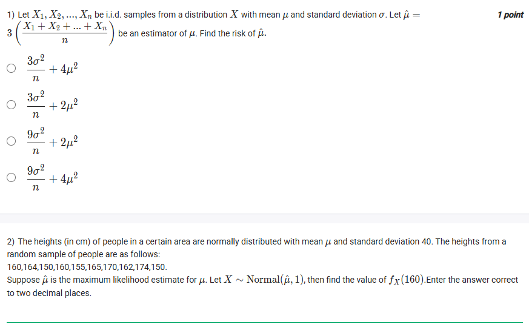
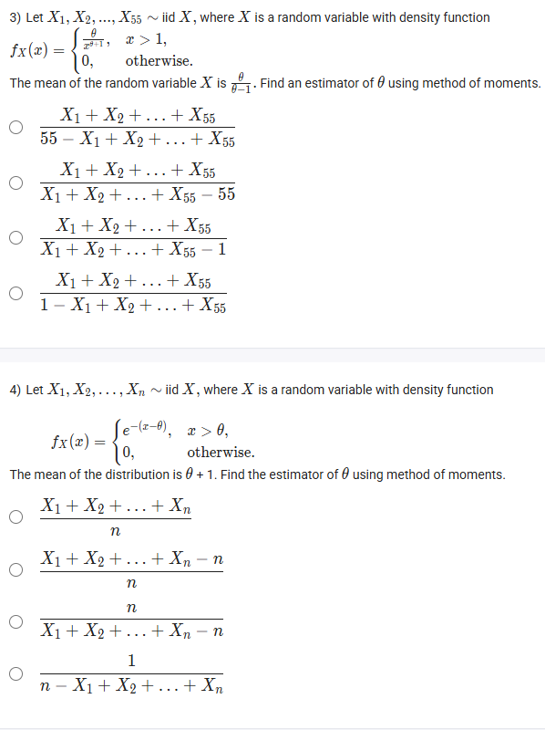
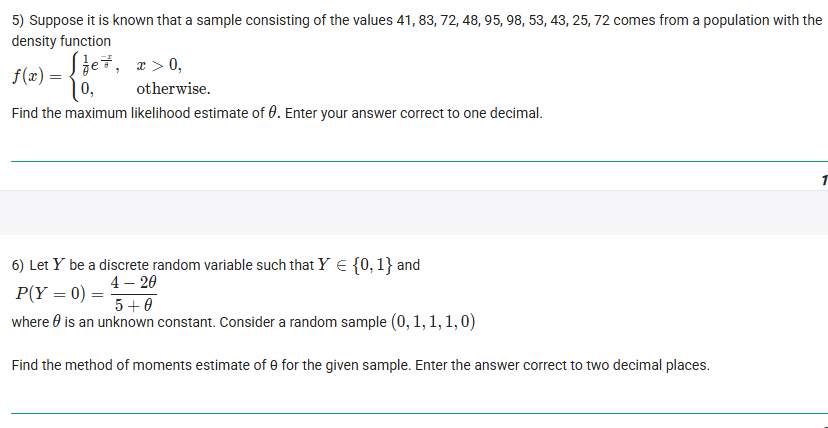
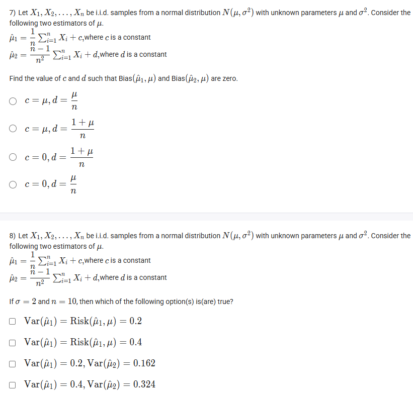
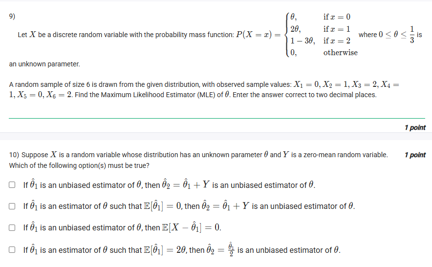
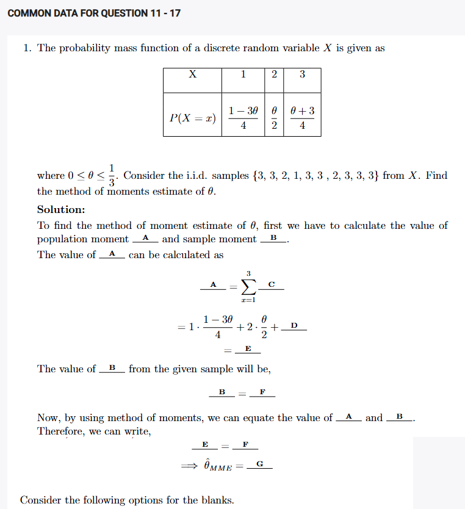
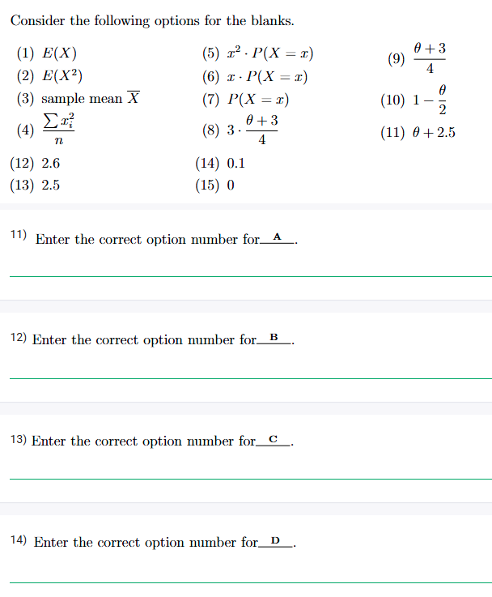
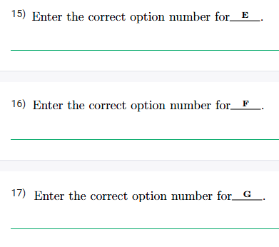

## Exercise Questions ❓

## Exercise Solutions 🟩

Hello Aryan. It looks like you are working through some solid Method of Moments (MME) and Maximum Likelihood Estimation (MLE) problems for your Statistics II course. These are foundational concepts for inference.

Here are the step-by-step solutions and concept explanations for the 10 questions extracted from the images, formatted exactly as you requested.


### Question 1: Risk of an Estimator

**Problem Statement:**
Let $X_1, X_2, ..., X_n$ be i.i.d. samples from a distribution $X$ with mean $\mu$ and standard deviation $\sigma$. Let $\hat{\mu} = 3\left(\frac{X_1 + X_2 + ... + X_n}{n}\right)$ be an estimator of $\mu$. Find the risk of $\hat{\mu}$.

**Concept:**
The **Risk** (specifically Mean Squared Error or MSE) of an estimator is the sum of its Variance and the square of its Bias.
$$Risk(\hat{\theta}) = MSE(\hat{\theta}) = Var(\hat{\theta}) + [Bias(\hat{\theta})]^2$$
* **Bias:** $E[\hat{\theta}] - \theta$
* **Variance:** $Var(\hat{\theta})$

**Solution:**
1.  **Identify the Estimator:**
    We can rewrite the estimator as $\hat{\mu} = 3\bar{X}$, where $\bar{X}$ is the sample mean.

2.  **Calculate Bias:**
    $$E[\hat{\mu}] = E[3\bar{X}] = 3E[\bar{X}] = 3\mu$$
    $$Bias(\hat{\mu}) = E[\hat{\mu}] - \mu = 3\mu - \mu = 2\mu$$
    $$Bias^2 = (2\mu)^2 = 4\mu^2$$

3.  **Calculate Variance:**
    $$Var(\hat{\mu}) = Var(3\bar{X}) = 3^2 \cdot Var(\bar{X}) = 9 \cdot \frac{\sigma^2}{n}$$

4.  **Calculate Risk:**
    $$Risk = Var(\hat{\mu}) + Bias^2 = \frac{9\sigma^2}{n} + 4\mu^2$$

**Correct Option:**
$$\frac{9\sigma^2}{n} + 4\mu^2$$



### Question 2: Normal Distribution Function

**Problem Statement:**
Heights are normally distributed $N(\mu, 40^2)$. Sample: 160, 164, 150, 160, 155, 165, 170, 162, 174, 150.
$\hat{\mu}$ is the MLE for $\mu$. Let $X \sim N(\hat{\mu}, 1)$. Find $f_X(160)$.

**Concept:**
For a Normal distribution, the Maximum Likelihood Estimator (MLE) for the population mean $\mu$ is simply the **sample mean** ($\bar{x}$).

**Solution:**
1.  **Find MLE ($\hat{\mu}$):**
    Sum of sample = $160+164+150+160+155+165+170+162+174+150 = 1610$
    $n = 10$
    $\hat{\mu} = \frac{1610}{10} = 161$

2.  **Define the new Random Variable $X$:**
    The problem states $X \sim N(161, 1)$. (Mean = 161, Variance $\sigma^2 = 1$).

3.  **Calculate PDF value at x = 160:**
    The PDF of a normal distribution is:
    $$f(x) = \frac{1}{\sigma\sqrt{2\pi}} e^{-\frac{1}{2}\left(\frac{x-\mu}{\sigma}\right)^2}$$
    Substitute $\mu=161, \sigma=1, x=160$:
    $$f(160) = \frac{1}{1\sqrt{2\pi}} e^{-\frac{1}{2}\left(\frac{160-161}{1}\right)^2}$$
    $$f(160) = \frac{1}{\sqrt{2\pi}} e^{-0.5}$$
    Using approximations $\sqrt{2\pi} \approx 2.5066$ and $e^{-0.5} \approx 0.6065$:
    $$f(160) \approx \frac{0.6065}{2.5066} \approx 0.24$$

**Answer:**
**0.24**



### Question 3: Method of Moments (Pareto-like Distribution)

**Problem Statement:**
$X$ has density $f_x(x) = \frac{\theta}{x^{\theta+1}}, x > 1$. Mean is $\frac{\theta}{\theta-1}$. Find MME for $\theta$ with sample size 55.

**Concept:**
**Method of Moments Estimation (MME):** Equate the theoretical population mean ($E[X]$) to the sample mean ($\bar{X}$) and solve for the parameter.

**Solution:**
1.  **Equate Means:**
    $$\bar{X} = \frac{\theta}{\theta - 1}$$

2.  **Solve for $\theta$:**
    $$\bar{X}(\theta - 1) = \theta$$
    $$\bar{X}\theta - \bar{X} = \theta$$
    $$\bar{X}\theta - \theta = \bar{X}$$
    $$\theta(\bar{X} - 1) = \bar{X}$$
    $$\hat{\theta} = \frac{\bar{X}}{\bar{X} - 1}$$

3.  **Convert to Sum Notation:**
    We know $\bar{X} = \frac{\sum X_i}{n} = \frac{S}{55}$ (where $S$ is the sum).
    $$\hat{\theta} = \frac{\frac{S}{55}}{\frac{S}{55} - 1}$$
    Multiply numerator and denominator by 55:
    $$\hat{\theta} = \frac{S}{S - 55}$$
    $$\hat{\theta} = \frac{X_1 + ... + X_{55}}{(X_1 + ... + X_{55}) - 55}$$

**Correct Option:**
$$\frac{X_1 + X_2 + ... + X_{55}}{X_1 + X_2 + ... + X_{55} - 55}$$



### Question 4: Method of Moments (Shifted Exponential)

**Problem Statement:**
$f_x(x) = e^{-(x-\theta)}, x > \theta$. Mean is $\theta + 1$. Find MME for $\theta$.

**Solution:**
1.  **Equate Means:**
    $$\bar{X} = \theta + 1$$

2.  **Solve for $\theta$:**
    $$\hat{\theta} = \bar{X} - 1$$

3.  **Substitute Sample Mean Formula:**
    $$\hat{\theta} = \frac{\sum X_i}{n} - 1$$
    $$\hat{\theta} = \frac{\sum X_i - n}{n}$$

**Correct Option:**
$$\frac{X_1 + X_2 + ... + X_n - n}{n}$$



### Question 5: MLE Calculation

**Problem Statement:**
Sample: 41, 83, 72, 48, 95, 98, 53, 43, 25, 72.
PDF: $f(x) = \frac{1}{\theta} e^{-x/\theta}$. Find MLE of $\theta$.

**Concept:**
This PDF corresponds to an **Exponential Distribution** with scale parameter $\theta$ (which is also the mean). For an exponential distribution, the MLE is simply the sample mean $\bar{X}$.

**Derivation (Quick check):**
$L(\theta) = \theta^{-n} e^{-\sum x_i / \theta}$.
$\ln L = -n \ln \theta - \frac{1}{\theta} \sum x_i$.
Differentiate and set to 0: $-\frac{n}{\theta} + \frac{\sum x_i}{\theta^2} = 0 \Rightarrow \hat{\theta} = \frac{\sum x_i}{n} = \bar{X}$.

**Solution:**
1.  **Calculate Sum:** $41+83+72+48+95+98+53+43+25+72 = 630$.
2.  **Calculate Mean:** $n=10$.
    $$\hat{\theta} = \frac{630}{10} = 63$$

**Answer:**
**63.0**



### Question 6: MME for Discrete Variable

**Problem Statement:**
$Y \in \{0, 1\}$. $P(Y=0) = \frac{4-2\theta}{5+\theta}$.
Sample: $(0, 1, 1, 1, 0)$. Find MME estimate of $\theta$.

**Solution:**
1.  **Calculate Population Mean $E[Y]$:**
    Since $Y$ is Bernoulli (0 or 1):
    $E[Y] = 1 \cdot P(Y=1) + 0 \cdot P(Y=0) = P(Y=1)$.
    First, find $P(Y=1)$:
    $$P(Y=1) = 1 - P(Y=0) = 1 - \frac{4-2\theta}{5+\theta}$$
    $$P(Y=1) = \frac{(5+\theta) - (4-2\theta)}{5+\theta} = \frac{1 + 3\theta}{5+\theta}$$
    So, Population Mean = $\frac{1 + 3\theta}{5+\theta}$.

2.  **Calculate Sample Mean:**
    Sample: 0, 1, 1, 1, 0. Sum = 3. $n=5$.
    $$\bar{Y} = \frac{3}{5} = 0.6$$

3.  **Equate and Solve:**
    $$0.6 = \frac{1 + 3\theta}{5+\theta}$$
    $$0.6(5+\theta) = 1 + 3\theta$$
    $$3 + 0.6\theta = 1 + 3\theta$$
    $$2 = 2.4\theta$$
    $$\theta = \frac{2}{2.4} = \frac{20}{24} = \frac{5}{6} \approx 0.833$$

**Answer:**
**0.83**



### Question 7: Unbiased Estimators

**Problem Statement:**
$\hat{\mu}_1 = \frac{1}{n} \sum X_i + c$
$\hat{\mu}_2 = \frac{n-1}{n^2} \sum X_i + d$
Find $c$ and $d$ such that Bias is zero (Unbiased).

**Concept:**
An estimator is unbiased if $E[\hat{\theta}] = \theta$.

**Solution:**
1.  **For $\hat{\mu}_1$:**
    $$E[\hat{\mu}_1] = E[\bar{X} + c] = \mu + c$$
    For zero bias, $\mu + c = \mu \Rightarrow c = 0$.

2.  **For $\hat{\mu}_2$:**
    Note that $\frac{n-1}{n^2} \sum X_i = \frac{n-1}{n} \left( \frac{1}{n} \sum X_i \right) = \frac{n-1}{n} \bar{X}$.
    $$E[\hat{\mu}_2] = E\left[\frac{n-1}{n} \bar{X} + d\right] = \frac{n-1}{n}\mu + d$$
    For zero bias:
    $$\frac{n-1}{n}\mu + d = \mu$$
    $$d = \mu - \frac{n-1}{n}\mu = \mu \left(1 - \frac{n-1}{n}\right) = \mu \left(\frac{1}{n}\right) = \frac{\mu}{n}$$

**Correct Option:**
$$c=0, d=\frac{\mu}{n}$$



### Question 8: Variance and Risk Comparison

**Problem Statement:**
Using the estimators from Q7, with $\sigma=2$ and $n=10$. Which options are true?

**Analysis:**
1.  **Calculate $Var(\hat{\mu}_1)$:**
    $\hat{\mu}_1 = \bar{X} + c$. Since $c$ is constant, $Var(\hat{\mu}_1) = Var(\bar{X})$.
    $$Var(\bar{X}) = \frac{\sigma^2}{n} = \frac{2^2}{10} = \frac{4}{10} = 0.4$$

2.  **Calculate $Var(\hat{\mu}_2)$:**
    $\hat{\mu}_2 = \frac{n-1}{n} \bar{X} + d$.
    $$Var(\hat{\mu}_2) = \left(\frac{n-1}{n}\right)^2 Var(\bar{X})$$
    $$Var(\hat{\mu}_2) = \left(\frac{9}{10}\right)^2 (0.4) = 0.81 \times 0.4 = 0.324$$

3.  **Evaluate Options:**
    * Option 1 & 2 discuss Risk. Risk depends on Bias. Without knowing specific $c$ or $d$ values (or assuming the unbiased versions from Q7), we can't definitively calculate Risk. However, we can definitely calculate Variance based on the constants given in the options.
    * Option 4 states: $Var(\hat{\mu}_1) = 0.4, Var(\hat{\mu}_2) = 0.324$.
    This matches our calculation perfectly.

**Correct Option:**
$$Var(\hat{\mu}_1) = 0.4, Var(\hat{\mu}_2) = 0.324$$



### Question 9: Discrete MLE

**Problem Statement:**
$P(X=0)=\theta, P(X=1)=2\theta, P(X=2)=1-3\theta$.
Sample: $0, 1, 2, 1, 0, 2$. Find MLE of $\theta$.

**Solution:**
1.  **Count Frequencies:**
    0 appears 2 times.
    1 appears 2 times.
    2 appears 2 times.

2.  **Construct Likelihood Function:**
    $$L(\theta) = P(0)^2 \cdot P(1)^2 \cdot P(2)^2$$
    $$L(\theta) = (\theta)^2 \cdot (2\theta)^2 \cdot (1-3\theta)^2$$
    $$L(\theta) = 4 \cdot \theta^4 \cdot (1-3\theta)^2$$

3.  **Log-Likelihood:**
    $$l(\theta) = \ln(4) + 4\ln(\theta) + 2\ln(1-3\theta)$$

4.  **Differentiate and Solve:**
    $$\frac{d}{d\theta} l(\theta) = \frac{4}{\theta} + \frac{2(-3)}{1-3\theta} = 0$$
    $$\frac{4}{\theta} = \frac{6}{1-3\theta}$$
    $$4(1-3\theta) = 6\theta$$
    $$4 - 12\theta = 6\theta$$
    $$18\theta = 4$$
    $$\theta = \frac{4}{18} = \frac{2}{9} \approx 0.222$$

**Answer:**
**0.22**



### Question 10: Properties of Estimators

**Problem Statement:**
$Y$ is a zero-mean random variable ($E[Y]=0$). $\hat{\theta}_1$ estimates $\theta$. Check properties of $\hat{\theta}_2$.

**Analysis of Options:**
1.  **Option 1:** "If $\hat{\theta}_1$ is an unbiased estimator of $\theta$, then $\hat{\theta}_2 = \hat{\theta}_1 + Y$ is an unbiased estimator of $\theta$."
    * Check: $E[\hat{\theta}_2] = E[\hat{\theta}_1 + Y] = E[\hat{\theta}_1] + E[Y]$.
    * Given $\hat{\theta}_1$ is unbiased, $E[\hat{\theta}_1] = \theta$. Given $E[Y] = 0$.
    * Result: $E[\hat{\theta}_2] = \theta + 0 = \theta$. **True.**

2.  **Option 4:** "If $\hat{\theta}_1$ is an estimator such that $E[\hat{\theta}_1] = 2\theta$, then $\hat{\theta}_2 = \frac{\hat{\theta}_1}{2}$ is an unbiased estimator."
    * Check: $E[\hat{\theta}_2] = E\left[\frac{\hat{\theta}_1}{2}\right] = \frac{1}{2}E[\hat{\theta}_1]$.
    * Substitute condition: $\frac{1}{2}(2\theta) = \theta$.
    * Result: Unbiased. **True.**

*(Note: Since this is likely a Multiple Select Question, both logic statements hold true independently, but Option 1 is the most direct application of the "zero-mean noise" concept presented in the prompt).*

**Correct Options:**
* If $\hat{\theta}_1$ is an unbiased estimator of $\theta$, then $\hat{\theta}_2 = \hat{\theta}_1 + Y$ is an unbiased estimator of $\theta$.
* If $\hat{\theta}_1$ is an estimator of $\theta$ such that $E[\hat{\theta}_1] = 2\theta$, then $\hat{\theta}_2 = \frac{\hat{\theta}_1}{2}$ is an unbiased estimator of $\theta$.


Hello Aryan. You've uploaded a fill-in-the-blank style problem set that walks through the entire process of finding a **Method of Moments Estimator (MME)**. This is a great way to learn the logical flow of estimation.

Here is the step-by-step breakdown for each question (11 through 17), explaining the concepts behind each blank.


### Context: Method of Moments
The core idea of the Method of Moments is simple: **Nature's average (Population Mean) should roughly equal our observed average (Sample Mean).**

To find the unknown parameter $\theta$:
1.  Calculate the theoretical **Population Mean** ($E[X]$) in terms of $\theta$.
2.  Calculate the actual **Sample Mean** ($\bar{X}$) from your data.
3.  Set them equal and solve for $\theta$.

This problem follows these exact steps.



### Question 11: Identify Blank A

**Context:** The solution states, "calculate the value of population moment **A**".
In the Method of Moments for a single parameter, we always start with the **First Moment**, which is the Expectation or Mean of the random variable.

**Analysis:**
* **A** represents the theoretical average of the population.
* Mathematically, this is denoted as $E[X]$.

**Correct Option:**
**(1) $E(X)$**



### Question 12: Identify Blank B

**Context:** The solution states, "...and sample moment **B**".
The counterpart to the population mean ($E[X]$) is the average calculated from the specific data points we observed.

**Analysis:**
* **B** represents the empirical average from the sample.
* This is called the Sample Mean, denoted as $\bar{X}$.

**Correct Option:**
**(3) sample mean $\bar{X}$**



### Question 13: Identify Blank C

**Context:** We are calculating **A** ($E[X]$) using the formula $\sum_{x=1}^{3} \mathbf{C}$.
The definition of Expected Value (Mean) for a discrete variable is the sum of each value multiplied by its probability.
$$E[X] = \sum x \cdot P(X=x)$$

**Analysis:**
* The term inside the summation ($\mathbf{C}$) must be the value $x$ multiplied by its probability $P(X=x)$.

**Correct Option:**
**(6) $x \cdot P(X=x)$**



### Question 14: Identify Blank D

**Context:** We are expanding the sum:
$$E[X] = 1 \cdot P(X=1) + 2 \cdot P(X=2) + \mathbf{D}$$
The expansion adds up the terms for $x=1$, $x=2$, and $x=3$. The term for $x=3$ is missing.

**Analysis:**
* The missing term corresponds to $x=3$.
* Term = $3 \times P(X=3)$.
* From the table, $P(X=3) = \frac{\theta+3}{4}$.
* Therefore, $\mathbf{D} = 3 \cdot \frac{\theta+3}{4}$.

**Correct Option:**
**(8) $3 \cdot \frac{\theta+3}{4}$**



### Question 15: Identify Blank E

**Context:** **E** is the simplified result of the calculation for $E[X]$. Let's do the algebra.

**Calculation:**
$$E[X] = 1\left(\frac{1-3\theta}{4}\right) + 2\left(\frac{\theta}{2}\right) + 3\left(\frac{\theta+3}{4}\right)$$
Make denominators common (all 4):
$$E[X] = \frac{1-3\theta}{4} + \frac{4\theta}{4} + \frac{3\theta+9}{4}$$
Combine numerators:
$$E[X] = \frac{(1 - 3\theta) + (4\theta) + (3\theta + 9)}{4}$$
$$E[X] = \frac{1 + 9 - 3\theta + 7\theta}{4}$$
$$E[X] = \frac{10 + 4\theta}{4}$$
$$E[X] = \frac{10}{4} + \frac{4\theta}{4} = 2.5 + \theta$$

**Correct Option:**
**(11) $\theta + 2.5$**



### Question 16: Identify Blank F

**Context:** The value of **B** (Sample Mean) is **F**. We need to calculate the mean of the given sample.
**Sample:** $\{3, 3, 2, 1, 3, 3, 2, 3, 3, 3\}$

**Calculation:**
1.  **Sum:** $3+3+2+1+3+3+2+3+3+3 = 26$
2.  **Count ($n$):** 10
3.  **Mean ($\bar{X}$):** $\frac{26}{10} = 2.6$

So, **F** is 2.6.

**Correct Option:**
**(12) 2.6**



### Question 17: Identify Blank G

**Context:** We equate **A** ($E[X]$) and **B** ($\bar{X}$) to find the estimator $\hat{\theta}_{MME}$.
$$E = F$$

**Calculation:**
$$\theta + 2.5 = 2.6$$
Subtract 2.5 from both sides:
$$\theta = 2.6 - 2.5$$
$$\theta = 0.1$$

So, the estimated value **G** is 0.1.

**Correct Option:**
**(14) 0.1**
