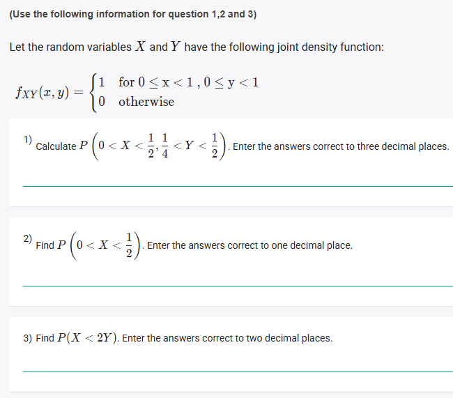
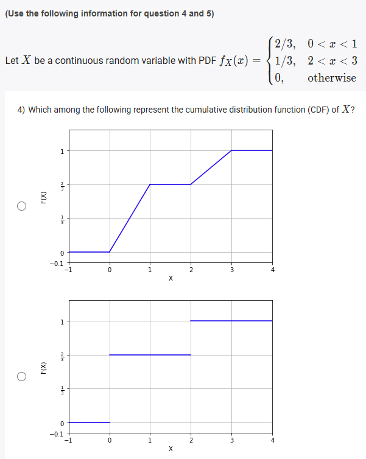
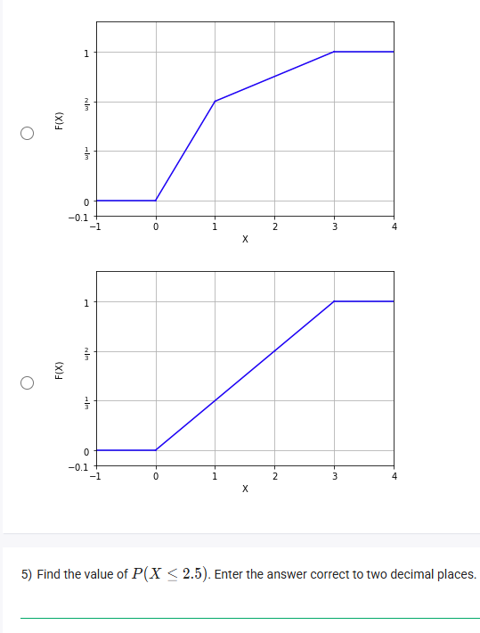
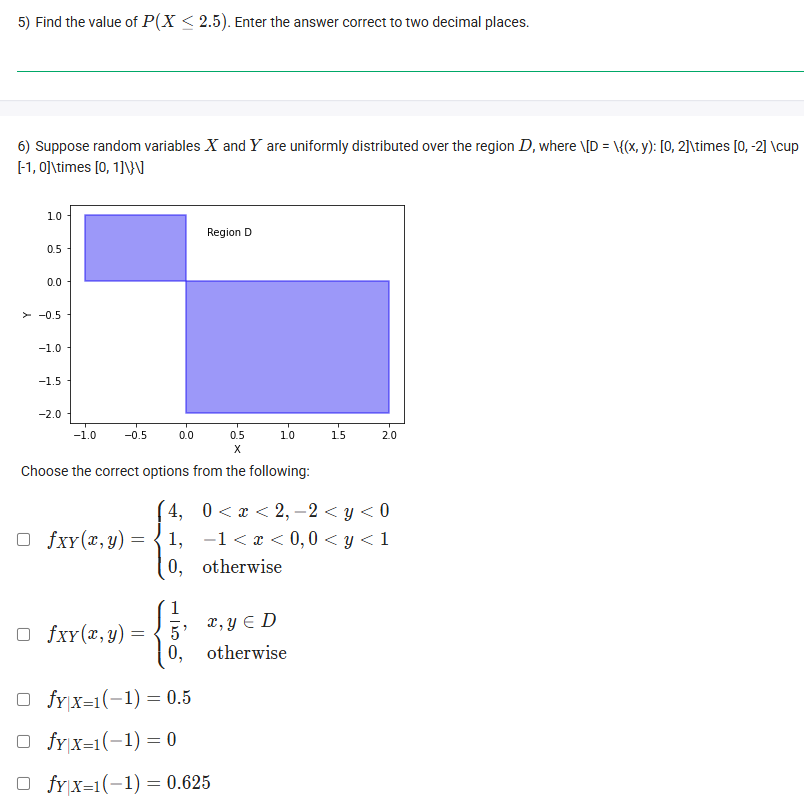
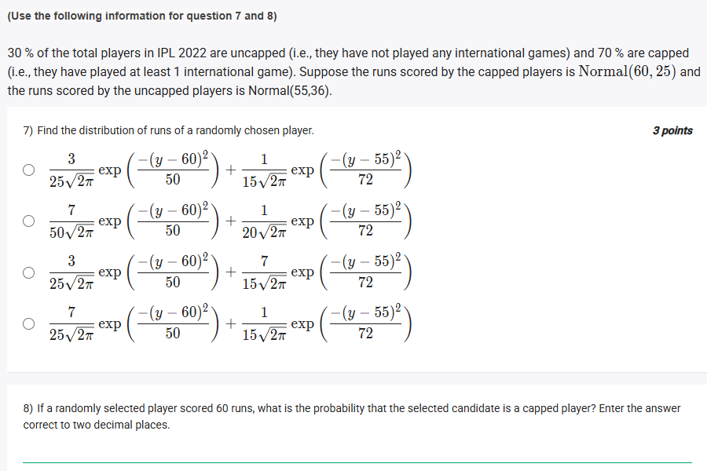
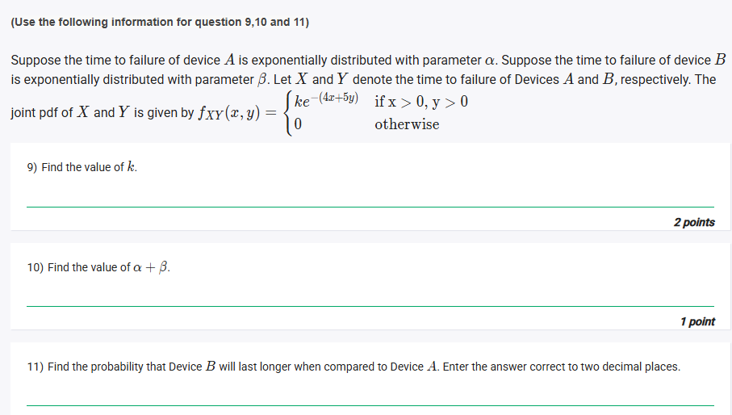
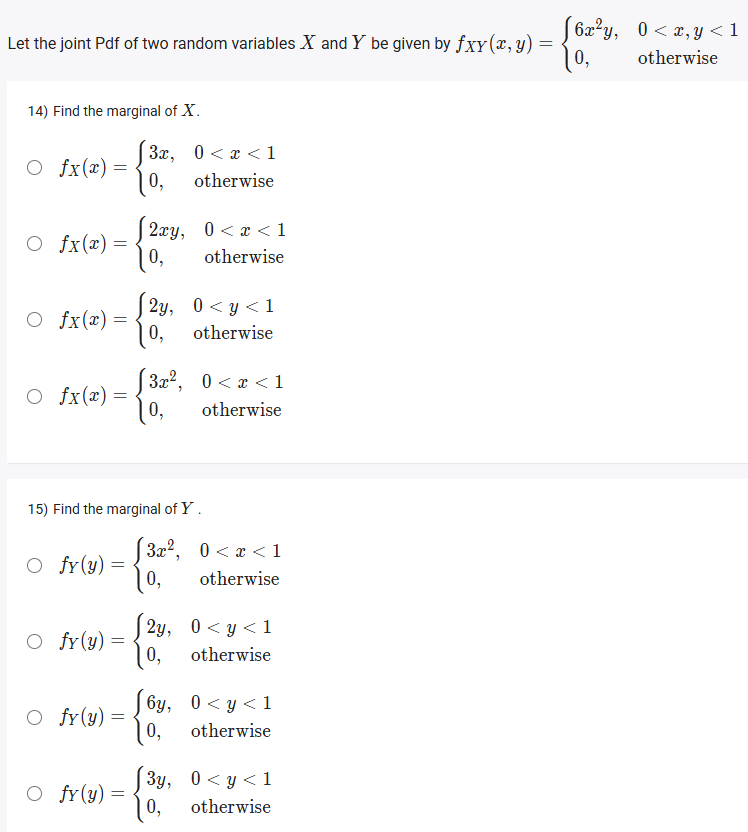

## Exercise Questions ❓

## Exercise Solutions 🟩

Here are the detailed solutions and concept explanations for each of the questions you provided.


### ❓ Question 1
(Using information from the image with questions 1, 2, and 3)

**Question:** Let the random variables $X$ and $Y$ have the joint density function:
$f_{XY}(x, y) = \begin{cases} 1 & \text{for } 0 \le x < 1, 0 \le y < 1 \\ 0 & \text{otherwise} \end{cases}$

Calculate $P\left(0 < X < \frac{1}{2}, \frac{1}{4} < Y < \frac{1}{2}\right)$. Enter the answers correct to three decimal places.

---

#### 💡 Concept: Probability as Area for Uniform Distributions
This joint PDF $f_{XY}(x, y)$ describes a **uniform distribution** over the unit square (from $x=0$ to $x=1$ and $y=0$ to $y=1$).

For a continuous joint PDF, you find probability by calculating the volume under the PDF curve over the region of interest.
$$P((X, Y) \in A) = \iint_A f_{XY}(x, y) \,dx \,dy$$
Because our PDF has a constant height of **1** inside the unit square, this integral simplifies. The probability is just the **area of the region of interest**, as long as that region is inside the unit square.
$$\text{Probability} = \text{Area} \times \text{Height of PDF} = \text{Area} \times 1 = \text{Area}$$

#### Solution
1.  **Identify the Region:** The problem asks for the probability of the rectangular region $A$ defined by $0 < X < \frac{1}{2}$ and $\frac{1}{4} < Y < \frac{1}{2}$.
2.  **Check Support:** This entire region is inside the support (the $1 \times 1$ unit square).
3.  **Calculate the Area:** The region is a rectangle.
    * $\text{Width} = (\text{upper } x) - (\text{lower } x) = \frac{1}{2} - 0 = \frac{1}{2}$
    * $\text{Height} = (\text{upper } y) - (\text{lower } y) = \frac{1}{2} - \frac{1}{4} = \frac{1}{4}$
4.  **Area** = $\text{Width} \times \text{Height} = \frac{1}{2} \times \frac{1}{4} = \frac{1}{8}$
5.  **Find Probability:** Since the PDF height is 1 in this region, the probability is equal to the area.
    * $P = \text{Area} = \frac{1}{8}$
6.  **Format Answer:** To convert to a decimal, $1 \div 8 = 0.125$.

**Answer:** **0.125**



### ❓ Question 2
(Using information from the image with questions 1, 2, and 3)

**Question:** Find $P\left(0 < X < \frac{1}{2}\right)$. Enter the answer correct to one decimal place.

---

#### 💡 Concept: Marginal Probability from a Joint PDF
This question asks for a **marginal probability**—the probability of $X$ being in a range, regardless of the value of $Y$. To find this, we consider the *entire* possible range of $Y$ *within the support*.

The region of interest is $0 < X < \frac{1}{2}$ and (implicitly) $0 \le Y < 1$ (the full range of $Y$ from the PDF's definition).

#### Solution
1.  **Identify the Region:** The region is defined by $0 < X < \frac{1}{2}$ and $0 \le Y < 1$.
2.  **Calculate the Area:** This is again a simple rectangle.
    * $\text{Width} = (\text{upper } x) - (\text{lower } x) = \frac{1}{2} - 0 = \frac{1}{2}$
    * $\text{Height} = (\text{upper } y) - (\text{lower } y) = 1 - 0 = 1$
3.  **Area** = $\text{Width} \times \text{Height} = \frac{1}{2} \times 1 = \frac{1}{2}$
4.  **Find Probability:** $P = \text{Area} = \frac{1}{2}$
5.  **Format Answer:** $\frac{1}{2} = 0.5$.

**Answer:** **0.5**



### ❓ Question 3
(Using information from the image with questions 1, 2, and 3)

**Question:** Find $P(X < 2Y)$. Enter the answer correct to two decimal places.

---

#### 💡 Concept: Probability of a Non-Rectangular Region
Here, the region of interest is not a simple rectangle. It's the area *within the unit square* that also satisfies the inequality $X < 2Y$.
We can rewrite the inequality as $Y > \frac{X}{2}$. We need to find the area of the portion of the unit square that is *above* the line $Y = \frac{X}{2}$.

#### Solution
1.  **Sketch the Region:**
    * Draw the $1 \times 1$ unit square (our support).
    * Draw the line $Y = \frac{X}{2}$. This line starts at $(0, 0)$ and goes to $(1, \frac{1}{2})$.
    * The region $Y > \frac{X}{2}$ is the area *above* this line.
    * We want the area of this region *inside* the square.

    
2.  **Calculate the Area:**
    It's easier to calculate the area of the small triangle *below* the line and subtract it from the total area of the square.
    * $\text{Area of unit square} = 1 \times 1 = 1$.
    * The unwanted area (below the line $Y = \frac{X}{2}$) is a triangle with vertices at $(0, 0)$, $(1, 0)$, and $(1, \frac{1}{2})$.
    * $\text{Area of triangle} = \frac{1}{2} \times \text{base} \times \text{height}$
    * $\text{Area of triangle} = \frac{1}{2} \times 1 \times \frac{1}{2} = \frac{1}{4}$
3.  **Find the Desired Area:**
    * $\text{Area}(Y > \frac{X}{2}) = \text{Area}(\text{Square}) - \text{Area}(\text{Triangle})$
    * $\text{Area}(Y > \frac{X}{2}) = 1 - \frac{1}{4} = \frac{3}{4}$
4.  **Find Probability:** $P(X < 2Y) = \text{Area} = \frac{3}{4}$
5.  **Format Answer:** $\frac{3}{4} = 0.75$.

**Answer:** **0.75**



### ❓ Question 4
(Using information from the image with questions 4 and 5)

**Question:** Let $X$ be a continuous random variable with PDF $f_X(x) = \begin{cases} 2/3, & 0 < x < 1 \\ 1/3, & 2 < x < 3 \\ 0, & \text{otherwise} \end{cases}$
Which among the following represent the cumulative distribution function (CDF) of $X$?

---

#### 💡 Concept: Deriving the CDF from the PDF
The **Cumulative Distribution Function (CDF)**, $F(x)$, is the probability $P(X \le x)$. It is the integral of the **Probability Density Function (PDF)**, $f(t)$, from $-\infty$ to $x$.
$$F(x) = \int_{-\infty}^{x} f(t) \,dt$$
Key properties:
* The CDF $F(x)$ is the "running total" of probability.
* The value of the PDF $f(x)$ is the **slope** of the CDF $F(x)$.
* Where $f(x) = 0$ (like between $x=1$ and $x=2$), the CDF $F(x)$ will be **flat** (slope = 0).
* Where $f(x)$ is a positive constant (like $2/3$), the CDF $F(x)$ will be a **straight line** with that constant as its slope.

This means the correct CDF graph must be **piecewise linear**, not a step function. This immediately rules out the bottom graph. Let's build the correct CDF (the top graph) step-by-step.

#### Solution
1.  **For $x \le 0$:**
    The PDF $f(x)$ is 0. The total accumulated probability is 0.
    $F(x) = 0$. The graph starts at $(-\infty, 0)$ and goes to $(0, 0)$.

2.  **For $0 < x < 1$:**
    The PDF $f(x)$ is $2/3$. The CDF increases with a slope of $2/3$.
    $F(x) = F(0) + \int_{0}^{x} \frac{2}{3} \,dt = 0 + \frac{2}{3}x = \frac{2}{3}x$.
    At the end of this interval, $F(1) = \frac{2}{3}(1) = \frac{2}{3}$.
    *The graph is a straight line from $(0, 0)$ to $(1, 2/3)$.*

3.  **For $1 \le x < 2$:**
    The PDF $f(x)$ is 0. The slope of the CDF is 0, so it's a flat horizontal line. It stays at the last probability it reached.
    $F(x) = F(1) = \frac{2}{3}$.
    *The graph is a flat line from $(1, 2/3)$ to $(2, 2/3)$.*

4.  **For $2 \le x < 3$:**
    The PDF $f(x)$ is $1/3$. The CDF now increases again, with a slope of $1/3$.
    $F(x) = F(2) + \int_{2}^{x} \frac{1}{3} \,dt = \frac{2}{3} + \left[ \frac{1}{3}t \right]_2^x = \frac{2}{3} + (\frac{1}{3}x - \frac{2}{3}) = \frac{1}{3}x$.
    At the end of this interval, $F(3) = \frac{1}{3}(3) = 1$.
    *The graph is a straight line from $(2, 2/3)$ to $(3, 1)$.*

5.  **For $x \ge 3$:**
    The PDF $f(x)$ is 0. The slope is 0. The CDF has accumulated all possible probability (a total of 1) and stays flat.
    $F(x) = 1$.
    *The graph is a flat line at $y=1$ for all $x \ge 3$.*

**Answer:** The **top graph** is the correct representation of the CDF.



### ❓ Question 5
(Using information from the image with questions 4 and 5)

**Question:** Find the value of $P(X \le 2.5)$. Enter the answer correct to two decimal places.

---

#### 💡 Concept: Using the CDF to Find Probability
The CDF $F(x)$ is *defined* as $P(X \le x)$. Therefore, finding $P(X \le 2.5)$ is as simple as finding the value of the CDF $F(x)$ at $x = 2.5$.

We can use the piecewise function we derived in Question 4.

#### Solution
1.  **Identify the Interval:** The value $x = 2.5$ falls into the interval $2 \le x < 3$.
2.  **Find the CDF Formula:** In the previous question, we found that for $2 \le x < 3$, the CDF is:
    $F(x) = \frac{1}{3}x$
    *(Alternatively, $F(x) = F(2) + (\text{probability from 2 to x}) = \frac{2}{3} + \int_{2}^{x} \frac{1}{3} \,dt = \frac{2}{3} + \frac{1}{3}(x-2)$)*
3.  **Evaluate at $x = 2.5$:** Let's use the second, more intuitive formula:
    * $F(2.5) = F(2) + (\text{probability from 2 to 2.5})$
    * $F(2.5) = \frac{2}{3} + \int_{2}^{2.5} \frac{1}{3} \,dt$
    * $F(2.5) = \frac{2}{3} + \left[ \frac{1}{3}t \right]_2^{2.5}$
    * $F(2.5) = \frac{2}{3} + \left( \frac{1}{3}(2.5) - \frac{1}{3}(2) \right)$
    * $F(2.5) = \frac{2}{3} + \left( \frac{2.5}{3} - \frac{2}{3} \right)$
    * $F(2.5) = \frac{2}{3} + \frac{0.5}{3} = \frac{2.5}{3}$
    * $F(2.5) = \frac{5/2}{3} = \frac{5}{6}$
4.  **Convert to Decimal:**
    $5 \div 6 = 0.8333...$
5.  **Format Answer:** Rounding to two decimal places, we get $0.83$.

**Answer:** **0.83**



### ❓ Question 6
(Using information from the image with question 6)

**Question:** Suppose random variables $X$ and $Y$ are uniformly distributed over the region $D$, where $D = \{(x, y): [0, 2] \times [-2, 0] \cup [-1, 0] \times [0, 1]\}$.
Choose the correct options from the following:
* $f_{XY}(x, y) = \begin{cases} 4, & 0 < x < 2, -2 < y < 0 \\ 1, & -1 < x < 0, 0 < y < 1 \\ 0, & \text{otherwise} \end{cases}$
* $f_{XY}(x, y) = \begin{cases} \frac{1}{5}, & x, y \in D \\ 0, & \text{otherwise} \end{cases}$
* $f_{Y|X=1}(-1) = 0.5$
* $f_{Y|X=1}(-1) = 0$
* $f_{Y|X=1}(-1) = 0.625$

---

#### 💡 Concept 1: Joint PDF for a Uniform Distribution
For a distribution to be **uniform** over a region $D$, its PDF $f_{XY}(x, y)$ must be a constant value $c$ for all points *inside* $D$. For the total probability (volume) to equal 1, this constant $c$ *must* be $1 / (\text{Total Area of } D)$.

#### 💡 Concept 2: Conditional PDF
The conditional PDF $f_{Y|X}(y|x)$ is the PDF of $Y$ *given* that $X$ is fixed at a specific value $x$. For a uniform distribution, this is found by:
1.  Taking a vertical "slice" of the region $D$ at the given $x$.
2.  The conditional distribution $f_{Y|X}(y|x)$ is a *new* uniform distribution, but only over that vertical slice.
3.  Its height will be $1 / (\text{Length of the slice})$.

#### Solution

**Part 1: Find the Joint PDF $f_{XY}(x, y)$**

1.  **Calculate the Total Area of $D$:** The region $D$ is made of two rectangles.
    * $\text{Rectangle 1}$ (bottom-right): $0 \le x \le 2$ and $-2 \le y \le 0$.
        $\text{Area}_1 = \text{width} \times \text{height} = (2 - 0) \times (0 - (-2)) = 2 \times 2 = 4$.
    * $\text{Rectangle 2}$ (top-left): $-1 \le x \le 0$ and $0 \le y \le 1$.
        $\text{Area}_2 = \text{width} \times \text{height} = (0 - (-1)) \times (1 - 0) = 1 \times 1 = 1$.
2.  **Total Area** = $\text{Area}_1 + \text{Area}_2 = 4 + 1 = 5$.
3.  **Find PDF Height:** Since the distribution is uniform, the PDF's height must be $1 / (\text{Total Area})$.
    $f_{XY}(x, y) = \frac{1}{5}$ for all $(x, y)$ in $D$.
4.  **Evaluate Options:**
    * The first option is incorrect. It suggests different densities in different parts of $D$.
    * The second option, $f_{XY}(x, y) = \begin{cases} \frac{1}{5}, & x, y \in D \\ 0, & \text{otherwise} \end{cases}$, is **correct**.

**Part 2: Find the Conditional PDF $f_{Y|X=1}(-1)$**

1.  **Condition:** We are given $X = 1$.
2.  **Find the "Slice":** Look at the region $D$ and draw a vertical line at $X=1$. This line *only* passes through the bottom-right rectangle.
3.  **Find the Length of the Slice:** At $X=1$, the possible $Y$ values are from $-2$ to $0$.
    * Length of slice = (top $y$) - (bottom $y$) = $0 - (-2) = 2$.
4.  **Determine Conditional PDF:** The conditional distribution of $Y$ given $X=1$ is uniform over the interval $[-2, 0]$. Its height is $1 / (\text{Length of slice})$.
    * $f_{Y|X=1}(y) = \frac{1}{2}$, for $-2 \le y \le 0$.
5.  **Evaluate at $y = -1$:** We need to find $f_{Y|X=1}(-1)$.
    * Since $y = -1$ is inside the interval $[-2, 0]$, the value of the PDF is $\frac{1}{2}$.
    * $\frac{1}{2} = 0.5$.
6.  **Evaluate Options:**
    * $f_{Y|X=1}(-1) = 0.5$ is **correct**.
    * The other two conditional options are incorrect.

**Answer:** The two correct options are:
* **$f_{XY}(x, y) = \begin{cases} \frac{1}{5}, & x, y \in D \\ 0, & \text{otherwise} \end{cases}$**
* **$f_{Y|X=1}(-1) = 0.5$**


Here are the detailed solutions and concept explanations for the next set of questions.


### ❓ Question 7
(Using information from the image with questions 7 and 8)

**Question:** 30% of the total players in IPL 2022 are uncapped... and 70% are capped... Suppose the runs scored by the capped players is Normal(60, 25) and the runs scored by the uncapped players is Normal(55, 36).

Find the distribution of runs of a randomly chosen player.

---

#### 💡 Concept: Law of Total Probability (Mixture Distributions)
The distribution of a randomly chosen player is a **mixture distribution**. Its PDF is a weighted average of the PDFs of the two subgroups (capped and uncapped).

The general formula is:
$f_{\text{Total}}(y) = P(\text{Capped}) \cdot f_{\text{Capped}}(y) + P(\text{Uncapped}) \cdot f_{\text{Uncapped}}(y)$

We also need the formula for a Normal distribution PDF:
$f(y) = \frac{1}{\sigma\sqrt{2\pi}} \exp\left(-\frac{(y - \mu)^2}{2\sigma^2}\right)$

#### Solution
1.  **Identify Components:**
    * **Capped Players:**
        * $P(\text{Capped}) = 0.7 = \frac{7}{10}$
        * Distribution: Normal($\mu_C = 60, \sigma_C^2 = 25$) $\implies \sigma_C = 5$
        * PDF: $f_{\text{Capped}}(y) = \frac{1}{5\sqrt{2\pi}} \exp\left(-\frac{(y - 60)^2}{2 \cdot 25}\right) = \frac{1}{5\sqrt{2\pi}} \exp\left(-\frac{(y - 60)^2}{50}\right)$
    * **Uncapped Players:**
        * $P(\text{Uncapped}) = 0.3 = \frac{3}{10}$
        * Distribution: Normal($\mu_U = 55, \sigma_U^2 = 36$) $\implies \sigma_U = 6$
        * PDF: $f_{\text{Uncapped}}(y) = \frac{1}{6\sqrt{2\pi}} \exp\left(-\frac{(y - 55)^2}{2 \cdot 36}\right) = \frac{1}{6\sqrt{2\pi}} \exp\left(-\frac{(y - 55)^2}{72}\right)$

2.  **Build the Mixture PDF:**
    $f_{\text{Total}}(y) = (0.7) \cdot f_{\text{Capped}}(y) + (0.3) \cdot f_{\text{Uncapped}}(y)$
    $f_{\text{Total}}(y) = \left(\frac{7}{10}\right) \left[ \frac{1}{5\sqrt{2\pi}} \exp\left(-\frac{(y - 60)^2}{50}\right) \right] + \left(\frac{3}{10}\right) \left[ \frac{1}{6\sqrt{2\pi}} \exp\left(-\frac{(y - 55)^2}{72}\right) \right]$

3.  **Simplify the Coefficients:**
    * First term's coefficient: $\frac{7}{10} \times \frac{1}{5} = \frac{7}{50}$
    * Second term's coefficient: $\frac{3}{10} \times \frac{1}{6} = \frac{3}{60} = \frac{1}{20}$

4.  **Final Equation:**
    $f_{\text{Total}}(y) = \frac{7}{50\sqrt{2\pi}} \exp\left(-\frac{(y - 60)^2}{50}\right) + \frac{1}{20\sqrt{2\pi}} \exp\left(-\frac{(y - 55)^2}{72}\right)$

**Answer:** This matches the **second option**.



### ❓ Question 8
(Using information from the image with questions 7 and 8)

**Question:** If a randomly selected player scored 60 runs, what is the probability that the selected candidate is a capped player? Enter the answer correct to two decimal places.

---

#### 💡 Concept: Bayes' Theorem (for Continuous Variables)
This is a conditional probability question. We want to find $P(\text{Capped} | Y = 60)$, where $Y$ is the random variable for runs.

Bayes' Theorem states:
$P(A|B) = \frac{P(B|A)P(A)}{P(B)}$

For our problem, this becomes:
$P(\text{Capped} | Y=60) = \frac{f(Y=60 | \text{Capped}) \cdot P(\text{Capped})}{f_{\text{Total}}(Y=60)}$

* $f(Y=60 | \text{Capped})$ is just the Capped PDF $f_{\text{Capped}}(60)$.
* $P(\text{Capped})$ is the prior probability, $0.7$.
* $f_{\text{Total}}(Y=60)$ is the total PDF from Question 7, evaluated at $y=60$.

#### Solution
1.  **Numerator: $f_{\text{Capped}}(60) \cdot P(\text{Capped})$**
    * $f_{\text{Capped}}(y) = \frac{1}{5\sqrt{2\pi}} \exp\left(-\frac{(y - 60)^2}{50}\right)$
    * $f_{\text{Capped}}(60) = \frac{1}{5\sqrt{2\pi}} \exp\left(-\frac{(60 - 60)^2}{50}\right) = \frac{1}{5\sqrt{2\pi}} \exp(0) = \frac{1}{5\sqrt{2\pi}}$
    * $\text{Numerator} = \left( \frac{1}{5\sqrt{2\pi}} \right) \cdot (0.7) = \frac{0.7}{5\sqrt{2\pi}}$

2.  **Denominator: $f_{\text{Total}}(60)$**
    This is $f_{\text{Capped}}(60) \cdot P(\text{Capped}) + f_{\text{Uncapped}}(60) \cdot P(\text{Uncapped})$
    * We already have the first part: $\frac{0.7}{5\sqrt{2\pi}}$
    * Let's find the second part: $f_{\text{Uncapped}}(60) \cdot P(\text{Uncapped})$
        * $f_{\text{Uncapped}}(y) = \frac{1}{6\sqrt{2\pi}} \exp\left(-\frac{(y - 55)^2}{72}\right)$
        * $f_{\text{Uncapped}}(60) = \frac{1}{6\sqrt{2\pi}} \exp\left(-\frac{(60 - 55)^2}{72}\right) = \frac{1}{6\sqrt{2\pi}} \exp\left(-\frac{25}{72}\right)$
        * $\text{Second Part} = \left( \frac{1}{6\sqrt{2\pi}} \exp\left(-\frac{25}{72}\right) \right) \cdot (0.3) = \frac{0.3}{6\sqrt{2\pi}} \exp\left(-\frac{25}{72}\right)$
    * $\text{Denominator} = \frac{0.7}{5\sqrt{2\pi}} + \frac{0.3}{6\sqrt{2\pi}} \exp\left(-\frac{25}{72}\right)$

3.  **Calculate the Probability:**
    $P(\text{Capped} | Y=60) = \frac{\frac{0.7}{5\sqrt{2\pi}}}{\frac{0.7}{5\sqrt{2\pi}} + \frac{0.3}{6\sqrt{2\pi}} \exp\left(-\frac{25}{72}\right)}$

    We can cancel $\frac{1}{\sqrt{2\pi}}$ from the numerator and denominator:
    $P(\text{Capped} | Y=60) = \frac{\frac{0.7}{5}}{\frac{0.7}{5} + \frac{0.3}{6} \exp\left(-\frac{25}{72}\right)}$

4.  **Plug in Values:**
    * $\frac{0.7}{5} = 0.14$
    * $\frac{0.3}{6} = 0.05$
    * $\exp(-\frac{25}{72}) \approx \exp(-0.34722) \approx 0.70664$
    * $P(\text{Capped} | Y=60) = \frac{0.14}{0.14 + (0.05 \cdot 0.70664)}$
    * $P(\text{Capped} | Y=60) = \frac{0.14}{0.14 + 0.035332}$
    * $P(\text{Capped} | Y=60) = \frac{0.14}{0.175332} \approx 0.79848$

5.  **Format Answer:** Rounding to two decimal places, we get 0.80.

**Answer:** **0.80**



### ❓ Question 9
(Using information from the image with questions 9, 10, and 11)

**Question:** Suppose the time to failure... is exponentially distributed... Let $X$ and $Y$ denote the time to failure of Devices $A$ and $B$, respectively. The joint pdf of $X$ and $Y$ is given by
$f_{XY}(x, y) = \begin{cases} k e^{-(4x+5y)} & \text{if } x > 0, y > 0 \\ 0 & \text{otherwise} \end{cases}$

Find the value of $k$.

---

#### 💡 Concept: Normalizing a PDF
For any probability density function (PDF), the total integral (or "volume") under the function over its entire support (the region where it's non-zero) must be equal to **1**. We can use this fact to solve for the normalizing constant $k$.

#### Solution
1.  **Set up the Integral:**
    $\int_{-\infty}^{\infty} \int_{-\infty}^{\infty} f_{XY}(x, y) \,dx \,dy = 1$
    $\int_{0}^{\infty} \int_{0}^{\infty} k e^{-(4x+5y)} \,dx \,dy = 1$

2.  **Separate the Variables:** We can rewrite $e^{-(4x+5y)}$ as $e^{-4x} \cdot e^{-5y}$.
    $k \int_{0}^{\infty} \int_{0}^{\infty} e^{-4x} e^{-5y} \,dx \,dy = 1$
    $k \left( \int_{0}^{\infty} e^{-4x} \,dx \right) \left( \int_{0}^{\infty} e^{-5y} \,dy \right) = 1$

3.  **Solve the Integrals:**
    * $\int_{0}^{\infty} e^{-4x} \,dx = \left[ -\frac{1}{4} e^{-4x} \right]_0^\infty = (0) - (-\frac{1}{4} e^0) = \frac{1}{4}$
    * $\int_{0}^{\infty} e^{-5y} \,dy = \left[ -\frac{1}{5} e^{-5y} \right]_0^\infty = (0) - (-\frac{1}{5} e^0) = \frac{1}{5}$

4.  **Solve for $k$:**
    $k \left( \frac{1}{4} \right) \left( \frac{1}{5} \right) = 1$
    $k \left( \frac{1}{20} \right) = 1$
    $k = 20$

**Answer:** **20**



### ❓ Question 10
(Using information from the image with questions 9, 10, and 11)

**Question:** Find the value of $\alpha + \beta$.
(Given $X \sim \text{Exp}(\alpha)$ and $Y \sim \text{Exp}(\beta)$)

---

#### 💡 Concept: Independence and Marginal Distributions
The PDF of an exponential distribution with parameter $\lambda$ is $f(z) = \lambda e^{-\lambda z}$.
* $f_X(x) = \alpha e^{-\alpha x}$
* $f_Y(y) = \beta e^{-\beta y}$

If $X$ and $Y$ are independent, their joint PDF is the product of their marginal PDFs:
$f_{XY}(x,y) = f_X(x) \cdot f_Y(y)$

#### Solution
1.  **Check for Independence:**
    Our joint PDF is $f_{XY}(x,y) = 20 e^{-4x} e^{-5y}$. This function can be separated into a product of a function of only $x$ and a function of only $y$. This means $X$ and $Y$ are **independent**.

2.  **Find the Marginals:**
    $f_{XY}(x,y) = (C_1 e^{-4x}) \cdot (C_2 e^{-5y})$, where $C_1 \cdot C_2 = 20$.
    * For $f_X(x) = C_1 e^{-4x}$ to be a valid PDF, it must integrate to 1.
        $\int_{0}^{\infty} C_1 e^{-4x} \,dx = 1 \implies C_1 \cdot (\frac{1}{4}) = 1 \implies C_1 = 4$.
    * For $f_Y(y) = C_2 e^{-5y}$ to be a valid PDF, it must integrate to 1.
        $\int_{0}^{\infty} C_2 e^{-5y} \,dy = 1 \implies C_2 \cdot (\frac{1}{5}) = 1 \implies C_2 = 5$.
    *(Check: $C_1 \cdot C_2 = 4 \cdot 5 = 20$, which matches our $k$!)*

3.  **Identify Parameters:**
    * The marginal for $X$ is $f_X(x) = 4 e^{-4x}$.
    * Comparing this to the definition $f_X(x) = \alpha e^{-\alpha x}$, we see that $\alpha = 4$.
    * The marginal for $Y$ is $f_Y(y) = 5 e^{-5y}$.
    * Comparing this to the definition $f_Y(y) = \beta e^{-\beta y}$, we see that $\beta = 5$.

4.  **Calculate the Sum:**
    $\alpha + \beta = 4 + 5 = 9$.

**Answer:** **9**



### ❓ Question 11
(Using information from the image with questions 9, 10, and 11)

**Question:** Find the probability that Device $B$ will last longer when compared to Device $A$. Enter the answer correct to two decimal places.

---

#### 💡 Concept: Probability of $Y > X$
We need to find $P(Y > X)$. This can be solved in two ways:

1.  **Integration:** Integrate the joint PDF $f_{XY}(x,y)$ over the region where $y > x$ (and $x>0, y>0$).
        $P(Y > X) = \int_{0}^{\infty} \int_{x}^{\infty} 20 e^{-4x-5y} \,dy \,dx$

2.  **Shortcut for Independent Exponentials:** For two independent exponential random variables $X \sim \text{Exp}(\alpha)$ and $Y \sim \text{Exp}(\beta)$, there is a standard result:
    $P(X < Y) = \frac{\alpha}{\alpha + \beta}$
    (The probability that the one with parameter $\alpha$ "wins" is $\frac{\alpha}{\alpha + \beta}$)

The question asks for $P(Y > X)$, which is the same as $P(X < Y)$.

#### Solution
Using the shortcut (Method 2) is much faster.
1.  **Identify Parameters (from Q10):**
    * $\alpha = 4$
    * $\beta = 5$
2.  **Apply the Formula:**
    $P(Y > X) = P(X < Y) = \frac{\alpha}{\alpha + \beta}$
    $P(Y > X) = \frac{4}{4 + 5} = \frac{4}{9}$

3.  **Format Answer:**
    $4 \div 9 = 0.4444...$
    Rounding to two decimal places, we get 0.44.

*(Self-Check with Integration - Method 1):*
* $\text{Inner integral (w.r.t } y\text{): } \int_{x}^{\infty} 20 e^{-4x} e^{-5y} \,dy = 20 e^{-4x} \left[ -\frac{1}{5} e^{-5y} \right]_{y=x}^{y=\infty}$
    $= 20 e^{-4x} \left( (0) - (-\frac{1}{5} e^{-5x}) \right) = 4 e^{-4x} e^{-5x} = 4 e^{-9x}$
* $\text{Outer integral (w.r.t } x\text{): } \int_{0}^{\infty} 4 e^{-9x} \,dx = 4 \left[ -\frac{1}{9} e^{-9x} \right]_0^\infty$
    $= 4 \left( (0) - (-\frac{1}{9} e^0) \right) = 4 \left( \frac{1}{9} \right) = \frac{4}{9}$.
* The result is confirmed.

**Answer:** **0.44**



### ❓ Question 12
(Using information from the image with questions 12 and 13)

**Question:** Let $X$ be a continuous uniform random variable on $[0, 1]$ and $Y = \frac{1}{X}$.
Find the probability density function of $Y$.

---

#### 💡 Concept: Transformation of Variables (CDF Method)
We can find the PDF of $Y$ by first finding its Cumulative Distribution Function (CDF), $F_Y(y)$, and then differentiating it. $f_Y(y) = \frac{d}{dy} F_Y(y)$.

1.  **Find the support (range) of $Y$:**
    * $X$ is in $[0, 1]$.
    * When $X$ is close to 0 (e.g., $X=0.01$), $Y = 1/0.01 = 100$ (large). As $X \to 0^+$, $Y \to \infty$.
    * When $X=1$, $Y = 1/1 = 1$.
    * Therefore, the range of $Y$ is $[1, \infty)$. This immediately eliminates the first and third options.

2.  **Find the CDF of $Y$, $F_Y(y)$:**
    $F_Y(y) = P(Y \le y)$
    Substitute $Y = 1/X$:
    $F_Y(y) = P(1/X \le y)$
    Rearrange the inequality for $X$:
    $F_Y(y) = P(X \ge 1/y)$

3.  **Calculate the probability using $X$:**
    * We know $X \sim \text{Uniform}[0, 1]$, so its PDF $f_X(x) = 1$ for $0 \le x \le 1$.
    * The probability $P(X \ge 1/y)$ is the integral of $f_X(x)$ from $1/y$ to 1.
    * $P(X \ge 1/y) = \int_{1/y}^{1} f_X(x) \,dx = \int_{1/y}^{1} 1 \,dx$
    * $F_Y(y) = \left[ x \right]_{1/y}^1 = 1 - \frac{1}{y}$

4.  **Differentiate the CDF to get the PDF:**
    $f_Y(y) = \frac{d}{dy} F_Y(y) = \frac{d}{dy} \left( 1 - \frac{1}{y} \right) = \frac{d}{dy} (1 - y^{-1})$
    $f_Y(y) = 0 - (-1)y^{-2} = \frac{1}{y^2}$

5.  **State the full PDF:**
    $f_Y(y) = \frac{1}{y^2}$, for $1 \le y < \infty$.

**Answer:** This matches the **fourth option**.



### ❓ Question 13
(Using information from the image with questions 12 and 13)

**Question:** Find the value of $P(Y \le 2)$. Enter the answer correct to one decimal place.

---

#### 💡 Concept: Calculating Probability
We can solve this in three simple ways.

* **Method 1: Use the CDF of $Y$.**
    The definition of the CDF is $F_Y(y) = P(Y \le y)$. From Question 12, we found $F_Y(y) = 1 - \frac{1}{y}$.

* **Method 2: Integrate the PDF of $Y$.**
    $P(Y \le 2) = \int_{1}^{2} f_Y(y) \,dy$. We must integrate from 1 (the start of $Y$'s range) up to 2.

* **Method 3: Use the original variable $X$.**
    This is often the easiest way.

#### Solution
**Method 1 (Using CDF of Y):**
$P(Y \le 2) = F_Y(2) = 1 - \frac{1}{2} = \frac{1}{2} = 0.5$

**Method 2 (Integrating PDF of Y):**
$P(Y \le 2) = \int_{1}^{2} \frac{1}{y^2} \,dy = \left[ -\frac{1}{y} \right]_1^2$
$= \left( -\frac{1}{2} \right) - \left( -\frac{1}{1} \right) = -\frac{1}{2} + 1 = \frac{1}{2} = 0.5$

**Method 3 (Using X):**
$P(Y \le 2) = P(1/X \le 2)$
$P(1/X \le 2) = P(X \ge 1/2)$
Since $X$ is uniform on $[0, 1]$, the probability $P(X \ge 1/2)$ is simply the length of the interval $[1/2, 1]$ divided by the total length of the interval $[0, 1]$.
$\text{Probability} = \frac{\text{Length}([\frac{1}{2}, 1])}{\text{Length}([0, 1])} = \frac{1 - \frac{1}{2}}{1 - 0} = \frac{\frac{1}{2}}{1} = 0.5$

**Answer:** **0.5**



### ❓ Question 14
(Using information from the image with questions 14 and 15)

**Question:** Let the joint Pdf of two random variables $X$ and $Y$ be given by $f_{XY}(x, y) = \begin{cases} 6x^2y, & 0 < x < 1, 0 < y < 1 \\ 0, & \text{otherwise} \end{cases}$
Find the marginal of $X$.

---

#### 💡 Concept: Finding a Marginal PDF
To find the marginal PDF of one variable (e.g., $f_X(x)$), you "integrate out" the other variable ($y$) from the joint PDF. You integrate over the entire range of $y$.

$f_X(x) = \int_{-\infty}^{\infty} f_{XY}(x, y) \,dy$

#### Solution
1.  **Set up the Integral:**
    The range of $y$ is from 0 to 1.
    $f_X(x) = \int_{0}^{1} 6x^2y \,dy$

2.  **Integrate with respect to $y$:**
    When integrating with respect to $y$, we treat $x$ (and thus $6x^2$) as a constant.
    $f_X(x) = 6x^2 \left[ \int_{0}^{1} y \,dy \right]$

3.  **Solve the
    Integral:**
    $f_X(x) = 6x^2 \left[ \frac{1}{2}y^2 \right]_0^1$
    $f_X(x) = 6x^2 \left( \frac{1}{2}(1)^2 - \frac{1}{2}(0)^2 \right)$
    $f_X(x) = 6x^2 \left( \frac{1}{2} \right)$
    $f_X(x) = 3x^2$

4.  **State the full PDF:**
    This is valid for $0 < x < 1$. Otherwise, the probability is 0.
    $f_X(x) = \begin{cases} 3x^2, & 0 < x < 1 \\ 0, & \text{otherwise} \end{cases}$

**Answer:** This matches the **fourth option**.



### ❓ Question 15
(Using information from the image with questions 14 and 15)

**Question:** Find the marginal of $Y$.

---

#### 💡 Concept: Finding a Marginal PDF
To find the marginal PDF $f_Y(y)$, we "integrate out" the $x$ variable from the joint PDF. We integrate over the entire range of $x$.

$f_Y(y) = \int_{-\infty}^{\infty} f_{XY}(x, y) \,dx$

#### Solution
1.  **Set up the Integral:**
    The range of $x$ is from 0 to 1.
    $f_Y(y) = \int_{0}^{1} 6x^2y \,dx$

2.  **Integrate with respect to $x$:**
    When integrating with respect to $x$, we treat $y$ (and thus $6y$) as a constant.
    $f_Y(y) = 6y \left[ \int_{0}^{1} x^2 \,dx \right]$

3.  **Solve the Integral:**
    $f_Y(y) = 6y \left[ \frac{1}{3}x^3 \right]_0^1$
    $f_Y(y) = 6y \left( \frac{1}{3}(1)^3 - \frac{1}{3}(0)^3 \right)$
    $f_Y(y) = 6y \left( \frac{1}{3} \right)$
    $f_Y(y) = 2y$

4.  **State the full PDF:**
    This is valid for $0 < y < 1$. Otherwise, the probability is 0.
    $f_Y(y) = \begin{cases} 2y, & 0 < y < 1 \\ 0, & \text{otherwise} \end{cases}$

**Answer:** This matches the **second option**.
