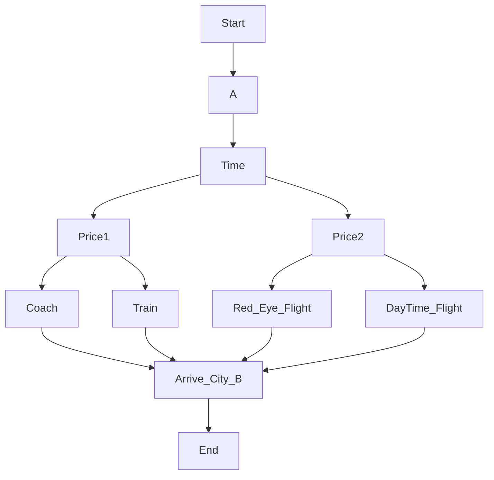

## Week 1 Lecture Notes 🗒️

#### PRINT 👨🏽‍💻

- Numbers are treated as numbers only when put without apostrophe/speech marks
- Strings require either single or double quotes
- Uses only round brackets `()`
- Uses comma to separate strings/variables

```python
print("Hello world")
print('Hello world', 'Hello mom', 'Hello nietzsche')
print(10)
```

#### VARIABLES 🔤

💡 Use well defined names for variables instead of a/b/c etc.

###### Input commands 

```python
print("Enter a number")
num=int(input())
print(num)
```

```python
age=int(input("Enter your age:"))
```

- `del` - Used to delete a variable

```python
x = 10
del x
print(x)
#shows error x not defined
```

#### DATA TYPES 1 🧩

- 🔢 int - Integer 
- 🔣 float - Decimal number
- 🔤 str - String- basically any letter or group of letters
- 📃 list -
  - Self explanatory
  - uses square bracket [ ]
  - uses comma to separate list items
  - indexing starts from 0 and not 1
  - negative indexing starts from -1 for the last elemen
  
```python
list = [10,'Amaan', 6.8]
print(l[0]) #prints 10
print(l[2]) #prints 6.8 and not Amaaan
print(type(l[20])) #prints <class 'str'>
```

```python
r= int(input("Enter the radius:"))
print(type(r))
#prints <class 'int'>
```

#### DATA TYPES 2

- `bool` - Boolean - Takes either true or false as input. T of true and F of false must always be capital

```python
b1 = True
b2 = False
```

#### Converting data types:

```python
a = float(9)
b = int(2.4)
c = int('11')
print(a, type(a)) #prints 9.0 <class 'float'>
print(b, type(b)) #prints 2 <class 'int'>
print(c, type(c)) #prints 11 <class 'int'>
```

```python
a = bool(100)
b = bool(-10.9)
c = bool(0)
d = bool('') #empty string
print(a, type(a)) #prints True <class 'bool>
print(b, type(b)) #prints True <class 'bool>
print(c, type(c)) #prints False <class 'bool>
print(d, type(d)) #prints False <class 'bool>
```

#### OPERATORS AND EXPRESSIONS 

💡 Follows BODMAS

##### MATHEMATICAL

- `+` - Sum/Union for lists
- `-` - Subtract
- `/` - Returns Float Quotient

```python
print(7/3)
#prints 2.333333333333335
```

- `*` - Multiplication
- `//` - Floor Division - Returns Integer Quotient

```python
print(7//3)
#prints 2
```

- `%` - Modulus - Remainder

```python
print(7%3)
#prints 1
```

- `**` - Exponential

##### RELATIONAL

- `<`, `>` , `>=` , `<=` - Self Explanatory
- `==` - Compares the two operands and returns the value as either True or False

```python
print(5==50)
#prints False
print(5==5)
#prints True
```

- `!=` - Not Equals to

```python
print(5!=50)
#prints True
print(5!=5)
#prints False
```

##### LOGICAL

- `and` , `or` , `not` - Logic gates. Returns either True or False as value

#### STRINGS

💡 Strings are treated like a list. Their letters are indexed just like lists. Starting from 0.

```python
s = 'coffee'
t = 'bread'
print(s[1:3]) #1:3 - goes from 1 to 2
#prints of
print(s[1:5]) #1:5 - goes from 1 to 4
#prints offe
```

```python
s='coffee'
t='bread'
print(s+t)
#prints coffeebread
```

💡 we can use only + and * operators on strings and not - and /

```python
s = 'good'
print(s[0]*5)
#prints ggggg
```

```python
print('apple' > 'one')
#prints False because a comes before o. it compares every letter of the string
```

```python
print('abce'> 'abcd')
#prints True
```

```python
s='huioiklopopopojhue'
print(len(s)) #prints length of the string
#prints 18
```

## WEEK 2 Lecture Notes 🗒️

- Comment - Starts with # . Isn't read by computer.

```python
#this is a comment and it isnt read by the computer
```

#### Short hand operator

- `+=` -

```python
count = count + 1
```

```python
count += 1 #should be read as count is equal to count + 1
```

- `-=` , `*=` , `/=` - Self explanatory

#### Special operator

- `in` - In operator - used to find some specific value in a string or variable or list, etc.

```python
print('alpha' in 'A variable name can only contain alpha-numeric characters and underscores')
#prints True as the string contains the word alpha
print('alpha' in 'A variable name must start with a letter or the underscore character')
#prints False as the string doesn't contain the word alpha
```                                                                

#### Chaining operator

When two or more relational operators are used together.

```python
x = 5
print(10<x<15)
#prints False as 5 is smaller than 10. Basically it acts like an OR logic gate. both statements need to be true to get the outp
```

#### Escape characters

- `\` - Back slash

```python
print('It's a beautiful day')
#returns error
print('It\'s a beautiful day')
#prints It's a beautiful day
print("We are from "IIT" Madras")
#returns error
print("We are from \"IIT\" Madras")
#prints We are from "IIT" Madras
```

- `\t` - Used to add tab space. Can be used repetitively. Ex - \t\t\t , etc

```python
print('My name is Fulkit. \t I am from Rijnob')
#prints My name is Fulkit. I am from Rijnob
```

- `\n` - New line in the same print command

```python
print('I am not here. \n This isnt happening')
#prints I am not here
# This isnt happening
```

#### Quotes

- `‘''` `‘''` - Multi line string

```python
z='''Amaan
AM
AP'''
print(z)
#prints Amaan
#AM
#AP
```

- `‘''` `‘''` - Multi line comment

```python
'''comment1
comment2
comment3'''
```

### String Methods

| Methods | Description | Code x = 'pytHo sTring mEthOds | Output |
| --------  | -------- | -------- | -------- |
| `lower()` | converts a string into lower case | `print(x.lower())`  | python string methods |
| `upper()` | converts a string into upper case | `print(x.upper())`  | python string methods |
| `capitalize()` | converts the first character to upper case | `print(x.capitalize())`  | python string methods |
| `title()` | converts the first letter of each word to upper case | `print(x.title())`  | python string methods |
| `swapcase()` | swaps upper to lower and lower to upper case in the string | `print(x.swapcase())`  | python string methods |

| Method | Description |
| --------  | -------- |
| `islower()` | Returns True if all characters in the string are lower case | 
| `isupper()` | Returns True if all characters in the string are upper case | 
| `istitle()` | Returns True if the string follows the rule of a title | 

| Code | Output |
| --------  | -------- |
| `x='python' print(x.islower())` | True | 
| `x='Python' print(x.islower())` | False | 
| `x='PYTHON' print(x.isupper())` | True | 
| `x='PYTHoN' print(x.isupper())` | False | 
| `x='Python String Methods' print(x.istitle())` | True | 
| `x='Python string methods' print(x.istitle()) ` | False | 

| Methods | Description |
| --------  | -------- |
| `isdigit()` | Returns True if all characters in the string are digit | 

| Code | Output |
| --------  | -------- |
| `x='123' print(x.isdigit())` | True | 
| ```x='123abc' print(x.isdigit())``` | False | 

| Idioms & Phrases | Meaning |
| --------  | -------- |
| Rank and File | Ordinary People | 

| Idioms & Phrases | Meaning |
| --------  | -------- |
| Rank and File | Ordinary People | 

| Idioms & Phrases | Meaning |
| --------  | -------- |
| Rank and File | Ordinary People | 

| Idioms & Phrases | Meaning |
| --------  | -------- |
| Rank and File | Ordinary People | 

| Idioms & Phrases | Meaning |
| --------  | -------- |
| Rank and File | Ordinary People | 

| Idioms & Phrases | Meaning |
| --------  | -------- |
| Rank and File | Ordinary People | 

| Idioms & Phrases | Meaning |
| --------  | -------- |
| Rank and File | Ordinary People | 

#### An interesting cipher: More on strings 🤌

- 👉 `alpha.index(n[i])` - finds index of the ‘i’th letter of ‘ n ’ in ‘ al ’
- 👉 `alpha.index(n[i])+1` - increases the index of that specific letter.
- 👉 we used `%26` to make sure the code doesn’t break if our ‘ n ’ has z in it.
- 👉 withouth `%26` it’ll show index error as there’s no letter ahead of z in ‘ al ’
- 👉 `%26` = we are calling out reminder after we divide our index number with 26 - so if ‘z’ i.e. 26 is divided by 26 it’ll give
- 👉 0 as reminder. This 0 = index 0 = ‘a’
- 👉 `(al[(al.index(n[i])+1)%26])` - gives us the +1 shifted letter of n
- 👉 we store it in an empty string `t` and append it with the letters shifted `+1` of our `n`

```python
al='abcdefghijklmnopqrstuvwxyz'
t=''
i=0
k=1
n='amaan'
#to print bnbbo - a letter shifter of my name
t+=(al[(al.index(n[i])+k)%26])
t+=(al[(al.index(n[i+1])+k)%26])
t+=(al[(al.index(n[i+2])+k)%26])
t+=(al[(al.index(n[i+3])+k)%26])
t+=(al[(al.index(n[i+4])+k)%26])
print(t)
```

[Replit Link](https://replit.com/@weakgeek/ceaser-cipher?v=1)

#### If statement

```python
dob=int(input("Enter your dob:"))
currentyear=2022
age=currentyear-dob
if (age<18):
print("Sorry you can't enter")
else:
print("Welcome aboard")
```

#### if, else and elif(else-if)

```python
marks=int(input("Enter marks obtained:"))
if(marks>=0 and marks <=100):
if (marks>=90):
print("A grade")
elif (marks>=80):
print("B grade")
elif (marks>=70):
print("C grade")
elif (marks>=60):
print("D grade")
else:
print("E grade")
else:
print("Invalid output")
```

```python
print('Travel from city A to city B')
time=int(input('Enter a time:'))
longer=int(input('Define longer:'))
if (time>=longer):
price=int(input('Enter price:'))
higher=int(input('Define higher:'))
if (price>=higher):
print('Train')
else:
print('Coach')
else:
price=int(input('Enter price:'))
higher=int(input('Define higher:'))
if(price>=higher):
print('Daytime Flight')
else:
print('Red eye Flight')
```



## Week 3 Lecture Notes 🗒️

### While loop ➿

- It gets executed till the condition is met.
- It quits when the condition is met.

```python
print("When did India got its independence?")
yr=int(input())
while(yr!=1947):
print("You got it wrong. Enter once again.")
yr=int(input())
print("You got it right!")
```

#### Compute Factorial 👨‍💻

```python
n=int(input("Enter the number:"))
i=1
f=1
while(i<=n):
f=f*i
i=i+1
print("Factorial is:", f)
```

- When the first time while loop runs f=1*1 and i is incremented by 1. Hence i becomes 2.
- Now the second time runs i is 2. Hence f=1*2=2. Again i is incremented and becomes 2+1 = 3.
- This continues till i>n

#### Practice questions on While loop 🧠

###### Problem 1: Find the factorial of the given number❓

- Find factorial of a given number:

**Test Cases**

| no. | Input | Expected Output |
| --------  | -------- | -------- |
| 1 | 5 | 120 |  
| 2 | 2 | 2 |  
| 3 | 0 | 1 |  
| 4 | -7 | Not defined |  

```python
n=int(input("Enter the number:"))
i=1
f=1
if (n>0):
while(i<=n):
f=f*i
i=i+1
print("Factorial is:", f)
else:
print("Invalid input")
```

###### Problem 2: Find the number of digits in a given number❓

- Find the number of digits in a given number.

**Test Cases**

| no. | Input | Expected Output |
| --------  | -------- | -------- |
| 1 | 5 | 120 |  
| 2 | 2 | 2 |  
| 3 | 0 | 1 |  
| 4 | 0 | 1 |  
| 5 | 0 | 1 |  

```python
n = abs(int(input("Enter the number:")))
digits = 1
while (n > 9):
n = n // 10
digits += 1
print("Number of digits are:", digits)
```

###### Problem 3: Reverse the given number❓
  
- Reverse the given number

**Test Cases**

| no. | Input | Expected Output |
| --------  | -------- | -------- |
| 1 | 5 | 120 |  
| 2 | 2 | 2 |  
| 3 | 0 | 1 |  
| 4 | 0 | 1 |  
| 5 | 0 | 1 |  

```python
n=int(input("Enter the number:"))
num=abs(n)
sum=0
while(num>0):
r=num%10
sum=sum*10+r
num=num//10
if(n<=0):
print(sum-(2*sum))
else:
print(sum)
```

- Firstly, the num is divided by 10 to get its remiander - `%` is used for that. When we divide any number by 10 to get its remainder the remainder is always the last digit of the number. So r is the last digit of the input number now.
  
- `sum=sum*10+r` puts the last digit of the input number r as the first digit of the reverse number.
- 
- `num=num//10` gives the int quotient of the initial number when divided by 10. Any number when divided by 10 gives the integer quotiet the nummber itself bar the last digit of it. i.e. 1234//10 gives 123.
  
- The `sum=sum*10+r` for 1234 looks like sum=4 for the first cycle. `sum=4*10+3` for the second cycle. `sum=43*10+2` for the third cycle. `sum=432*10+1` for the last cycle.
  
- Find if the number is palindrome or not?